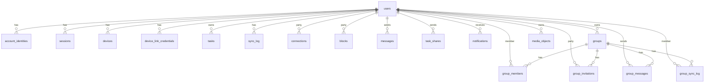

```markdown
# 📘 ARCHITECTURE.md — نسخه‌ی ۳.۴.۰

> نسخه: 3.4.0
> تاریخ: 2026-09-22
> وضعیت: FINAL — مبنای پیاده‌سازی
> جایگزین: ARCHITECTURE (نسخه 3.3.0)

---

## 📑 فهرست

1. اصول کلان
2. مدل Account و Identity
3. Password Security (Email Provider) — موکول به آینده
4. Session و Device
5. Sync Code (Device Linking)
6. Username
7. Personal Space
8. Group
9. Membership و Invitation
10. Group Task و Personal Task
11. Group Timeline
12. Connection و Blocking
13. Message و TaskShare
14. Notification
15. Sync Architecture
16. Account Deletion
17. Permission Matrix
18. Security Invariants
19. Database Model
20. API Model
21. File / Module Architecture
22. Migration Policy
23. تصمیم‌های FINAL
24. فازبندی Implementation
25. قواعدی که در Application پیاده می‌شوند
26. Media Service (مدیریت عکس‌ها)
27. Sidebar و Navigation
28. i18n (چندزبانه)
29. Search (جستجوی سراسری)
30. Security Framework (Cross-Cutting)

---

## ۱. اصول کلان

### Local-first
- **Local DB (IndexedDB)** = local working copy / operational source
- **D1** = authoritative cloud state برای داده‌های Sync‌شده
- **Communication data** = server-backed + Local cache
- ❌ هرگز داده‌های اصلی صرفاً برای ساده‌سازی Sync به D1 منتقل نمی‌شوند

### Account ≠ Identity
- **Account ID** = UUID داخلی
- **Identity Providers** = Telegram, Google (موکول), Email (موکول)
- **Username** = identifier ارتباطی مستقل

### Sync Code = Device Linking
- ❌ هرگز Account Creation
- ❌ هرگز Identity Provider
- ❌ هرگز Device Identity
- ✅ فقط اتصال Device جدید به Account موجود

### فرانت و بک فعلی حفظ می‌شوند
- فقط Auth/Account/Sync بازطراحی
- Communication + Group اضافه

### سه هدف بنیادین
1. Offline usability
2. Secure multi-device synchronization
3. Secure user-to-user communication (Direct + Group)

### اصل طلایی تصمیم‌گیری
> آیا این تغییر واقعاً architecture را ساده‌تر و قابل نگه‌داری‌تر می‌کند، یا فقط implementation فعلی را سریع‌تر می‌کند؟

### Security as Cross-Cutting Concern (V3.4)
> امنیت یک ویژگی است که در تمام لایه‌های معماری جاری است، نه یک فاز جداگانه.
> هر فاز، Security Gate مخصوص خودش را دارد.
> در پایان، یک Final Security Audit انجام می‌شود.
> (جزئیات در بخش ۳۰)

---

## ۲. مدل Account و Identity

### Account
- هویت داخلی (UUID)
- مستقل از provider
- یک Account می‌تواند چند Identity داشته باشد

### Schema

```sql
CREATE TABLE users (
    id                  TEXT PRIMARY KEY,
    username            TEXT UNIQUE,
    username_updated_at TEXT,
    status              TEXT NOT NULL DEFAULT 'active',
    token_ttl_days      INTEGER NOT NULL DEFAULT 90,
    change_seq_counter  INTEGER NOT NULL DEFAULT 0,
    profile             TEXT,
    created_at          TEXT NOT NULL,
    last_login_at       TEXT,
    last_sync_at        TEXT
);

CREATE INDEX idx_users_status ON users(status);
CREATE INDEX idx_users_username ON users(username);

CREATE TABLE account_identities (
    id                TEXT PRIMARY KEY,
    account_id        TEXT NOT NULL,
    provider          TEXT NOT NULL,
    provider_user_id  TEXT NOT NULL,
    provider_username TEXT,
    provider_data     TEXT,
    linked_at         TEXT NOT NULL,
    last_used_at      TEXT,
    FOREIGN KEY (account_id) REFERENCES users(id) ON DELETE CASCADE
);

CREATE UNIQUE INDEX idx_identities_provider_user
    ON account_identities(provider, provider_user_id);
CREATE INDEX idx_identities_account ON account_identities(account_id);
```

### Identity Providers

| Provider | provider_user_id | provider_data |
|----------|------------------|---------------|
| Telegram | `telegram_id` | `{ first_name, last_name, photo_url }` |
| Google | `google_sub` | `{ email, name, picture }` — موکول |
| Email | normalized email | `{ password_hash, ... }` — موکول |

### Account Creation
- ✅ فقط از Identity Provider معتبر
- ❌ Sync Code هرگز Account نمی‌سازد

### Profile Model
- **JSON در `users.profile`**: `displayName`, `avatarUrl`, `bio`
- **Preferences**: خارج از profile (Local/device-scoped)
- **Size limit**: ۴KB (policy)

### Unlink Identity
- حداقل ۱ Identity
- `> ۱` → Unlink آزاد
- `= ۱` → Unlink ممنوع + گزینه «حذف حساب»

---

## ۳. Password Security (Email Provider) — موکول به آینده

**وضعیت:** موکول به آینده به دلیل محدودیت سرویس‌های ایمیل (تحریم).

**پارامترهای طراحی‌شده (برای آینده):**
- PBKDF2-HMAC-SHA256
- 600,000 iterations
- Salt: 16 bytes per user
- Pepper: server-side (Worker Secret)

**جزئیات در پیوست ذخیره شده است.**

---

## ۴. Session و Device

### JWT Payload

```typescript
interface TokenPayload {
    sub: string;   // account_id
    did: string;   // device_id
    sid: string;   // session_id
    iat: number;
    exp: number;
    jti: string;
}
```

### Schema

```sql
CREATE TABLE devices (
    id                        TEXT PRIMARY KEY,
    user_id                   TEXT NOT NULL,
    display_name              TEXT,
    user_agent                TEXT,
    last_personal_change_seq  INTEGER NOT NULL DEFAULT 0,
    first_seen_at             TEXT NOT NULL,
    last_seen_at              TEXT NOT NULL,
    revoked_at                TEXT,
    FOREIGN KEY (user_id) REFERENCES users(id) ON DELETE CASCADE
);

CREATE INDEX idx_devices_user_id ON devices(user_id, last_seen_at);

CREATE TABLE sessions (
    id              TEXT PRIMARY KEY,
    user_id         TEXT NOT NULL,
    device_id       TEXT NOT NULL,
    created_at      TEXT NOT NULL,
    last_used_at    TEXT,
    expires_at      TEXT NOT NULL,
    revoked_at      TEXT,
    revoked_reason  TEXT,
    user_agent      TEXT,
    ip_hash         TEXT,
    FOREIGN KEY (user_id) REFERENCES users(id) ON DELETE CASCADE,
    FOREIGN KEY (device_id) REFERENCES devices(id) ON DELETE CASCADE
);

CREATE INDEX idx_sessions_user ON sessions(user_id, revoked_at);
CREATE INDEX idx_sessions_device ON sessions(device_id, revoked_at);
```

### JWT TTL vs Session TTL

| مفهوم | مقدار |
|--------|--------|
| JWT expiry (`exp`) | ۳۰/۹۰/۱۸۰/۳۶۵ روز (policy) |
| Session expiry | مستقل، می‌تواند کوتاه‌تر یا بلندتر |
| بررسی در هر request | **هر دو** |

### Revocation
- `sessions.revoked_at` → session باطل
- `devices.revoked_at` → همه sessions آن device باطل
- بررسی در هر authenticated request

### Session Invalidation Triggers
- Logout
- Device revoke
- Password change (آینده)
- Account deletion
- Admin action

---

## ۵. Sync Code (Device Linking)

### مدل

```
Existing Account
      ↓
Generate Sync Code
      ↓
10-min TTL
      ↓
Single-use
      ↓
Atomic consume
      ↓
Create/link device + session
```

### Schema

```sql
CREATE TABLE device_link_credentials (
    id                    TEXT PRIMARY KEY,
    user_id               TEXT NOT NULL,
    code_hash             TEXT NOT NULL,
    code_hint             TEXT,
    created_at            TEXT NOT NULL,
    expires_at            TEXT NOT NULL,
    consumed_at           TEXT,
    consumed_by_device_id TEXT,
    created_by_device_id  TEXT,
    revoked_at            TEXT,
    FOREIGN KEY (user_id) REFERENCES users(id) ON DELETE CASCADE
);

CREATE INDEX idx_device_link_hash ON device_link_credentials(code_hash);
CREATE INDEX idx_device_link_user ON device_link_credentials(user_id, expires_at);
```

### قواعد
- **TTL:** ۱۰ دقیقه
- **Single-use**
- **Hash + Pepper**
- **Atomic consume:** `UPDATE ... WHERE consumed_at IS NULL AND revoked_at IS NULL AND expires_at > now` + `changes() === 1`
- **حداکثر ۵ کد فعال/account**
- **Retention:** ۳۰ روز (audit)

### Migration از Sync Code قدیمی
- حذف شد در Reset
- UX: Banner + Notification

---

## ۶. Username

| مورد | تصمیم |
|------|--------|
| اجباری/اختیاری | اختیاری |
| فرمت | `^[a-zA-Z][a-zA-Z0-9_]{2,19}$` |
| Storage | lowercase |
| Display | با `@` |
| تغییر | ۲ بار در ۳۰ روز |
| Reservation نام قدیمی | ۳۰ روز (فقط جلوی دیگران) |
| Lookup | authenticated-only + exact match + rate limit |
| Reserved | ~۲۰ مورد قابل توسعه |

**⚠️ `username` ≠ `account_id`**

---

## ۷. Personal Space

```
Personal Account
 ├── Profile
 ├── Devices
 ├── Sessions
 ├── Personal Tasks
 └── Personal Communication State
```

### Ownership Check (اجباری)

```typescript
getTaskByIdForUser(taskId, userId)
// نه getTaskById(taskId)
```

---

## ۸. Group

### مدل

```
Account
 ├── Personal Space
 └── Groups
      ├── Group A (Private)
      ├── Group B (Public)
      └── ...
```

### Visibility

**هر گروه یکی از دو حالت را دارد:**

| نوع | در جستجو | عضویت | پیام‌ها |
|-----|----------|--------|---------|
| **Private** (پیش‌فرض) | ❌ پیدا نمی‌شود | فقط با دعوت | فقط اعضا |
| **Public** | ✅ پیدا می‌شود | با درخواست | فقط اعضا |

**⚠️ حتی گروه Public، پیام‌هایش فقط برای اعضا قابل مشاهده است. Public یعنی «قابل جستجو»، نه «قابل خواندن».**

### Schema

```sql
CREATE TABLE groups (
    id                 TEXT PRIMARY KEY,
    name               TEXT NOT NULL,
    owner_id           TEXT NOT NULL,
    avatar_url         TEXT,
    created_at         TEXT NOT NULL,
    archived_at        TEXT,
    closed_at          TEXT,
    change_seq_counter INTEGER NOT NULL DEFAULT 0,
    visibility         TEXT NOT NULL DEFAULT 'private',
    FOREIGN KEY (owner_id) REFERENCES users(id) ON DELETE RESTRICT
);

CREATE INDEX idx_groups_owner ON groups(owner_id);
CREATE INDEX idx_groups_name ON groups(name);
```

**⚠️ Group دارای `change_seq` مستقل**

**⚠️ `owner_id` با `ON DELETE RESTRICT` — جلوگیری از حذف owner بدون transfer**

---

## ۹. Membership و Invitation

### Group Membership

```sql
CREATE TABLE group_members (
    id                 TEXT PRIMARY KEY,
    group_id           TEXT NOT NULL,
    user_id            TEXT NOT NULL,
    role               TEXT NOT NULL,
    status             TEXT NOT NULL DEFAULT 'active',
    joined_at          TEXT NOT NULL,
    removed_at         TEXT,
    left_at            TEXT,
    last_change_seq    INTEGER NOT NULL DEFAULT 0,
    last_read_at       TEXT,
    last_task_read_at  TEXT,
    UNIQUE(group_id, user_id),
    FOREIGN KEY (group_id) REFERENCES groups(id) ON DELETE CASCADE,
    FOREIGN KEY (user_id) REFERENCES users(id) ON DELETE CASCADE
);

CREATE INDEX idx_group_members_user ON group_members(user_id, status);
CREATE INDEX idx_group_members_group ON group_members(group_id, status);
```

**فیلدهای جدید:**
- `last_read_at` — آخرین خواندن پیام‌ها (برای شمارش نخوانده‌ها)
- `last_task_read_at` — آخرین دیدن وظایف (فقط UI، نه نوتیفیکیشن)

### Group Invitation

**⚠️ Invitation ≠ Connection ≠ Sync Code**

```sql
CREATE TABLE group_invitations (
    id              TEXT PRIMARY KEY,
    group_id        TEXT NOT NULL,
    inviter_id      TEXT NOT NULL,
    invitee_id      TEXT NOT NULL,
    type            TEXT NOT NULL,
    status          TEXT NOT NULL DEFAULT 'pending',
    created_at      TEXT NOT NULL,
    expires_at      TEXT NOT NULL,
    responded_at    TEXT,
    FOREIGN KEY (group_id) REFERENCES groups(id) ON DELETE CASCADE,
    FOREIGN KEY (inviter_id) REFERENCES users(id) ON DELETE CASCADE,
    FOREIGN KEY (invitee_id) REFERENCES users(id) ON DELETE CASCADE
);

CREATE INDEX idx_group_invitations_invitee ON group_invitations(invitee_id, status);
CREATE INDEX idx_group_invitations_group ON group_invitations(group_id, status);
```

### دو نوع Membership

| نوع | مسیر | نتیجه |
|-----|------|-------|
| **Direct Add** | Owner دوست را اضافه می‌کند | Membership فوری `active` |
| **Invitation** | Owner دعوت‌نامه می‌فرستد | `pending` → accept/reject |

### ⚠️ محدودیت مهم: فقط دوستان

**کاربر فقط می‌تواند افرادی را به گروه اضافه کند که:**

1. **یک Connection پذیرفته‌شده با آن‌ها دارد** (`connections.status = 'accepted'`)
2. **آن‌ها کاربر را بلاک نکرده باشند** (نه در `blocks.blocked_id`)

**⚠️ حتی اگر یک طرف دوستی را پذیرفته باشد ولی طرف دیگر بلاک کرده باشد، اضافه‌کردن ممکن نیست.**

### Invitation TTL: ۷ روز

---

## ۱۰. Group Task و Personal Task

### تصمیم FINAL: جدول مشترک `tasks` با `scope`

```sql
CREATE TABLE tasks (
    id           TEXT PRIMARY KEY,
    scope        TEXT NOT NULL DEFAULT 'personal',
    owner_id     TEXT,
    group_id     TEXT,
    creator_id   TEXT NOT NULL,
    parent_id    TEXT,
    kind         TEXT NOT NULL DEFAULT 'task',
    payload      TEXT NOT NULL,
    checksum     TEXT NOT NULL,
    revision     INTEGER NOT NULL DEFAULT 1,
    created_at   TEXT NOT NULL,
    updated_at   TEXT NOT NULL,
    deleted_at   TEXT,
    device_id    TEXT,
    synced_at    TEXT NOT NULL,
    CHECK (
        (scope = 'personal' AND owner_id IS NOT NULL AND group_id IS NULL)
        OR
        (scope = 'group' AND owner_id IS NULL AND group_id IS NOT NULL)
    ),
    FOREIGN KEY (owner_id) REFERENCES users(id) ON DELETE CASCADE,
    FOREIGN KEY (creator_id) REFERENCES users(id) ON DELETE CASCADE,
    FOREIGN KEY (parent_id) REFERENCES tasks(id) ON DELETE CASCADE
);

CREATE INDEX idx_tasks_owner_id ON tasks(owner_id);
CREATE INDEX idx_tasks_group_id ON tasks(group_id);
CREATE INDEX idx_tasks_owner_updated ON tasks(owner_id, updated_at);
CREATE INDEX idx_tasks_group_updated ON tasks(group_id, updated_at);
CREATE INDEX idx_tasks_parent_id ON tasks(parent_id);
CREATE INDEX idx_tasks_deleted ON tasks(deleted_at);
```

### Permission Matrix

| عملیات | Creator | Group Owner | Member |
|--------|---------|-------------|--------|
| مشاهده Task | ✅ | ✅ | ✅ |
| ایجاد | ✅ | ✅ | ✅ |
| ویرایش Task خودش | ✅ | ✅ | ✅ |
| ویرایش Task دیگران | ❌ | ❌ | ❌ |
| حذف Task خودش | ✅ | ✅ | ✅ |
| حذف Task دیگران | ❌ | ✅ | ❌ |

**⚠️ Owner حق edit محتوا را ندارد — فقط delete برای moderation**

**⚠️ چرا Owner نمی‌تواند محتوا را edit کند؟**
- جلوگیری از دستکاری تاریخی (به‌عنوان moderation، فقط حذف).
- اگر Owner بخواهد محتوا را تغییر دهد، باید اول task را حذف و دوباره بسازد.
- این تصمیم در V3.3 قفل شده و در V3.4 بدون تغییر باقی مانده.

---

## ۱۱. Group Timeline

### مدل

**Timeline یک entity جدید نیست — یک Query ترکیبی است.**

```
Group Timeline = merge(Group Messages, Group Tasks) order by created_at DESC
```

**Schema ندارد. API projection/query است.**

### Cursor Pagination

```
GET /api/groups/:id/timeline?before=<cursor>&limit=50
```

**Cursor = (created_at, id) — برای جلوگیری از duplicate در صفحه‌بندی.**

---

## ۱۲. Connection و Blocking

### Blocking جدا از Connection

```sql
CREATE TABLE blocks (
    id              TEXT PRIMARY KEY,
    blocker_id      TEXT NOT NULL,
    blocked_id      TEXT NOT NULL,
    created_at      TEXT NOT NULL,
    UNIQUE(blocker_id, blocked_id),
    FOREIGN KEY (blocker_id) REFERENCES users(id) ON DELETE CASCADE,
    FOREIGN KEY (blocked_id) REFERENCES users(id) ON DELETE CASCADE
);

CREATE INDEX idx_blocks_blocker ON blocks(blocker_id);
CREATE INDEX idx_blocks_blocked ON blocks(blocked_id);
```

**⚠️ Block جدول مستقل است، نه یک status در `connections`**

### قواعد
- Block مستقل از Connection
- Block دوطرفه از نظر اثر
- Block قبل از Connection Request چک می‌شود
- Blocker افشا نمی‌شود
- **Block روی عضویت گروه تأثیر دارد:**
  - اگر کاربری توسط طرف مقابل بلاک شده باشد، نمی‌تواند به گروه اضافه شود

### Connection

```sql
CREATE TABLE connections (
    id              TEXT PRIMARY KEY,
    user_a_id       TEXT NOT NULL,
    user_b_id       TEXT NOT NULL,
    status          TEXT NOT NULL,
    requested_by    TEXT NOT NULL,
    requested_at    TEXT NOT NULL,
    accepted_at     TEXT,
    closed_at       TEXT,
    FOREIGN KEY (user_a_id) REFERENCES users(id) ON DELETE CASCADE,
    FOREIGN KEY (user_b_id) REFERENCES users(id) ON DELETE CASCADE
);

CREATE INDEX idx_connections_user_a ON connections(user_a_id, status);
CREATE INDEX idx_connections_user_b ON connections(user_b_id, status);
```

**⚠️ قاعده‌ی ۲۵.۱:** یکتایی ارتباط در کد تضمین می‌شود (همیشه `user_a_id < user_b_id`).

---

## ۱۳. Message و TaskShare

### سه نوع پیام

**هر پیام (در گروه یا خصوصی) می‌تواند یکی از سه نوع باشد:**

| نوع | `kind` | محتوای `metadata` |
|-----|--------|-------------------|
| **متنی** | `'text'` | `null` |
| **وظیفه** | `'task'` | `{ snapshot, source_task_id }` |
| **موقعیت** | `'location'` | `{ lat, lng, name, cityNames }` |

**ساختار `snapshot` برای `kind='task'`:**
```json
{
  "snapshot": {
    "text": "خرید نان",
    "kind": "task",
    "priority": "medium",
    "sessions": [{ "at": "2026-09-21T10:00:00.000Z" }],
    "location": { "lat": 35.7, "lng": 51.4 },
    "description": "..."
  },
  "source_task_id": "uuid-of-original-task"
}
```

### Direct Message

```sql
CREATE TABLE messages (
    id              TEXT PRIMARY KEY,
    sender_id       TEXT NOT NULL,
    recipient_id    TEXT NOT NULL,
    body            TEXT NOT NULL,
    created_at      TEXT NOT NULL,
    read_at         TEXT,
    edited_at       TEXT,
    deleted_at      TEXT,
    reply_to_id     TEXT,
    kind            TEXT NOT NULL DEFAULT 'text',
    metadata        TEXT,
    FOREIGN KEY (sender_id) REFERENCES users(id) ON DELETE CASCADE,
    FOREIGN KEY (recipient_id) REFERENCES users(id) ON DELETE CASCADE
);

CREATE INDEX idx_messages_pair ON messages(sender_id, recipient_id, created_at DESC);
CREATE INDEX idx_messages_recipient ON messages(recipient_id, created_at DESC);
```

**⚠️ Sender: create/read own. Recipient: read + mark-read.**

### Group Message

```sql
CREATE TABLE group_messages (
    id              TEXT PRIMARY KEY,
    group_id        TEXT NOT NULL,
    sender_id       TEXT NOT NULL,
    body            TEXT NOT NULL,
    created_at      TEXT NOT NULL,
    edited_at       TEXT,
    deleted_at      TEXT,
    reply_to_id     TEXT,
    kind            TEXT NOT NULL DEFAULT 'text',
    metadata        TEXT,
    FOREIGN KEY (group_id) REFERENCES groups(id) ON DELETE CASCADE,
    FOREIGN KEY (sender_id) REFERENCES users(id) ON DELETE CASCADE
);

CREATE INDEX idx_group_messages_group ON group_messages(group_id, created_at DESC);
```

### Task Share (Personal)

```sql
CREATE TABLE task_shares (
    id               TEXT PRIMARY KEY,
    sender_id        TEXT NOT NULL,
    recipient_id     TEXT NOT NULL,
    source_task_id   TEXT NOT NULL,
    snapshot         TEXT NOT NULL,
    status           TEXT NOT NULL,
    received_task_id TEXT,
    message          TEXT,
    created_at       TEXT NOT NULL,
    responded_at     TEXT,
    FOREIGN KEY (sender_id) REFERENCES users(id) ON DELETE CASCADE,
    FOREIGN KEY (recipient_id) REFERENCES users(id) ON DELETE CASCADE
);

CREATE INDEX idx_task_shares_recipient ON task_shares(recipient_id, status);
CREATE INDEX idx_task_shares_sender ON task_shares(sender_id, created_at DESC);
```

### رفتار پیام لوکیشن

**فرستنده:**
1. سه روش انتخاب لوکیشن:
   - کلیک مستقیم روی نقشه
   - انتخاب از لیست مکان‌های ذخیره‌شده
   - موقعیت فعلی
2. ارسال پیام با `kind='location'`

**گیرنده:**
1. نمایش پیام با اطلاعات مکان
2. دو دکمه:
   - **«نمایش روی نقشه»** — نقشه را به مختصات می‌برد
   - **«مسیر»** — مسیر بین کاربر و مقصد را محاسبه می‌کند

---

## ۱۴. Notification

```sql
CREATE TABLE notifications (
    id              TEXT PRIMARY KEY,
    user_id         TEXT NOT NULL,
    type            TEXT NOT NULL,
    payload         TEXT,
    read_at         TEXT,
    created_at      TEXT NOT NULL,
    FOREIGN KEY (user_id) REFERENCES users(id) ON DELETE CASCADE
);

CREATE INDEX idx_notifications_user ON notifications(user_id, read_at, created_at DESC);
```

### Types

**Personal:**
- `message:new`
- `connection:request`
- `connection:accepted`
- `task_share:new`
- `task_share:responded`

**Group:**
- `group:invitation`
- `group:member_added`
- `group:member_removed`
- `group:message:new`
- `group:task:new`
- `group:task:due` — ⚠️ **جدید**
- `group:location:new`

### قواعد مهم

**⚠️ نوتیفیکیشن سررسید (`group:task:due`) مستقل از `last_task_read_at` است.**

اگر وظیفه‌ای در گروه ارسال شود و کاربر آن را ندیده باشد، **نوتیفیکیشن سررسید آن همچنان در زمان مقرر فعال می‌شود**. «دیده‌نشدن» فقط برای شمارش UI است، نه برای نوتیفیکیشن.

---

## ۱۵. Sync Architecture

### Scopes

```
Personal scope
  change_seq: users.change_seq_counter

Group scope (per group)
  change_seq: groups.change_seq_counter
```

### Personal Sync Log

```sql
CREATE TABLE sync_log (
    id           INTEGER PRIMARY KEY AUTOINCREMENT,
    user_id      TEXT NOT NULL,
    change_seq   INTEGER NOT NULL,
    entity_id    TEXT,
    entity_type  TEXT,
    operation    TEXT NOT NULL,
    revision     INTEGER,
    device_id    TEXT,
    created_at   TEXT NOT NULL,
    FOREIGN KEY (user_id) REFERENCES users(id) ON DELETE CASCADE
);

CREATE UNIQUE INDEX idx_sync_log_user_seq ON sync_log(user_id, change_seq);
CREATE INDEX idx_sync_log_user_created ON sync_log(user_id, created_at);
```

### Group Sync Log

```sql
CREATE TABLE group_sync_log (
    id           INTEGER PRIMARY KEY AUTOINCREMENT,
    group_id     TEXT NOT NULL,
    change_seq   INTEGER NOT NULL,
    entity_id    TEXT,
    entity_type  TEXT,
    operation    TEXT NOT NULL,
    revision     INTEGER,
    device_id    TEXT,
    created_at   TEXT NOT NULL,
    FOREIGN KEY (group_id) REFERENCES groups(id) ON DELETE CASCADE
);

CREATE UNIQUE INDEX idx_group_sync_log_seq ON group_sync_log(group_id, change_seq);
CREATE INDEX idx_group_sync_log_group_created ON group_sync_log(group_id, created_at);
```

### Cursor

- `devices.last_personal_change_seq`
- `group_members.last_change_seq`

### Security Invariant

> **اگر User از Group حذف شد، نباید بعد از حذف داده‌های Group را از Sync دریافت کند.**

### Conflict Resolution

- `updated_at` per entity (منبع اصلی)
- `revision` per entity
- `change_seq` per scope
- **Atomicity: per-op، نه per-batch**

### ⚠️ قاعده‌ی مرکزی Sync

> **هیچ Feature جدیدی نباید Sync Protocol مخصوص خودش را داشته باشد.**
>
> همه‌ی Featureها (Media، Group، Message، Notification، Task، ...) باید از
> همان قرارداد Sync موجود عبور کنند:
>
> 1. تغییر در Local Store (IndexedDB)
> 2. ثبت در Outbox (Transactional با Store)
> 3. صف در `sync_queue` (IDB)
> 4. ارسال از طریق `POST /api/sync` (تنها نقطه‌ی ورود)
> 5. Worker با `applyBatch` پردازش می‌کند
> 6. پاسخ delta برمی‌گردد
>
> **استثناها فقط با تصمیم معماری صریح مجاز هستند:**
> - Endpointهای «presign» (مثل `POST /api/media/upload`) استثنا هستند
>   چون presign یک عملیات احراز هویت‌شده است، نه یک تغییر state.
> - Endpointهای «تأیید» (مثل `POST /api/media/:id/confirm`) استثنا **نیستند** —
>   چون تغییر state هستند و باید در `sync_log` ثبت شوند.
>
> **دلیل:** جلوگیری از رشد تصاعدی پیچیدگی Sync. اگر هر Feature
> منطق Sync خودش را داشته باشد، سیستم بعد از ۳-۴ Feature غیرقابل نگهداری
> می‌شود.

### Entity Types در sync_log

| `entity_type` | `operation` | توضیح |
|---------------|-------------|--------|
| `'task'` | `'save'`, `'delete'` | task شخصی |
| `'child'` | `'save'`, `'delete'` | زیرکار plan |
| `'media'` | `'media-confirm'`, `'media-delete'` | Media events (V3.4) |

**⚠️ Media `op_id`:**
- `media-confirm:{mediaId}` — هنگام تأیید upload
- `media-delete:{mediaId}` — هنگام soft-delete

---

## ۱۶. Account Deletion

### سه مفهوم جدا

| مفهوم | تعریف |
|--------|--------|
| **Account Closure** | حساب غیرفعال |
| **Data Deletion** | داده‌های شخصی حذف |
| **Audit Retention** | حداقل metadata anonymized |

### Data Classification Matrix

| داده | حذف | Anonymize | نگهداری |
|------|-----|-----------|---------|
| Email (آینده) | ✅ | — | ❌ |
| Telegram ID | ✅ | — | ❌ |
| Username | ✅ | — | ❌ |
| Profile | ✅ | — | ❌ |
| Personal Tasks | ✅ | — | ❌ |
| Personal Sync Log | ✅ | — | ❌ |
| Sessions | ✅ | — | ❌ |
| Devices | ✅ | — | ❌ |
| Device Link Credentials | ✅ | — | ❌ |
| Direct Messages (content) | — | ✅ sender | طبق سیاست |
| Task Shares (content) | — | ✅ sender | طبق سیاست |
| Group Messages (content) | — | ✅ sender | طبق سیاست |
| Group Tasks (content) | — | ✅ creator | طبق سیاست |
| Security audit metadata | — | ✅ | حداقل لازم |
| Media objects | ✅ via adapter | — | ❌ |

### Group Owner Deletion

```
Account deletion requested
        ↓
Owned groups exist?
        ↓
Yes → user MUST choose (per group):
      ├── Transfer ownership
      └── Close group
        ↓
No owned groups
        ↓
Continue deletion
```

**⚠️ «Prevent» ممنوع — سیستم نباید کاربر را گیر بیندازد**

**⚠️ Transfer خودکار بعد از ۳۰ روز ممنوع — نیاز به تصمیم صریح کاربر**

### Account Deletion Dependency Matrix

| Entity | Action |
|--------|--------|
| `users` | soft → hard (30d) |
| `account_identities` | cascade delete |
| `sessions` | revoke فوری |
| `devices` | cascade delete |
| `device_link_credentials` | cascade delete |
| `personal tasks` | cascade delete |
| `personal sync_log` | cascade delete |
| `connections` | cascade (soft) |
| `messages` | anonymize sender |
| `task_shares` | anonymize |
| `notifications` | cascade delete |
| `groups (owned)` | Transfer یا Close |
| `group_members` | cascade |
| `group_invitations` | cascade |
| `group_messages` | anonymize sender |
| `group_tasks` | anonymize creator |
| `group_sync_log` | cascade delete |
| **Media objects (ParsPack)** | **delete via adapter** |

---

## ۱۷. Permission Matrix

| موجودیت | Owner | Creator | Member | Other |
|---------|-------|---------|--------|-------|
| Account | R/W | — | — | ❌ |
| Personal Task | — | R/W | — | ❌ |
| Group | R/W (moderation) | — | read content | ❌ |
| Membership | manage | — | read own | ❌ |
| Group Message | read, delete any | write, edit own | read, write, edit own | ❌ |
| Group Task | read, delete any | write, edit own | read, create, edit own | ❌ |
| Connection | R/W (party) | — | — | ❌ |
| Direct Message | sender: create/read own | — | — | ❌ |
| Direct Message | recipient: read + mark-read | — | — | ❌ |
| Media Object | R/W (owner) | — | read (if group member) | ❌ |

### Security Invariant

> کاربر باید فقط پیام‌های conversationهایی را ببیند که عضو/طرف آن است.

> کاربر باید فقط عکس‌هایی را ببیند که مالک آن‌هاست یا در گروهی که عضو آن است.

### Media Authorization (چندرابطه‌ای)

| Action | Owner | Group Member | Message Participant |
|--------|-------|--------------|---------------------|
| read | ✅ | ✅ | ✅ (Phase 6+) |
| write | ✅ | ❌ | ❌ |
| delete | ✅ | ❌ | ❌ |

**⚠️ فقط owner می‌تواند upload و delete کند. Group member فقط می‌تواند read کند.**

---

## ۱۸. Security Invariants

```
sub از JWT — نه Body
```

```
هیچ client-provided userId نباید authority باشد
```

```
Ownership check در تمام عملیات حساس
```

```
Group membership در هر Group operation
```

```
Creator check برای edit
```

```
Owner check برای management (delete-only، نه edit)
```

```
Removed member نباید داده Group را Sync کند
```

```
Closed group نباید محتوای جدید دریافت کند
```

```
Blocked user نباید بتواند direct communication را دور بزند
```

```
Block نباید به‌طور خودکار Group membership را تغییر دهد
```

```
Invitation ≠ Connection ≠ Sync Code
```

```
Sync Code هرگز Account نمی‌سازد
```

```
Password هرگز plaintext یا reversible
```

```
CORS ≠ Authorization
```

```
Media bucket همیشه Private
```

```
Presigned URL فقط پس از احراز مجوز
```

```
Group visibility فقط «قابل جستجو» بودن است، نه «قابل خواندن»
```

```
Media Object فقط با authorization چندرابطه‌ای قابل دسترسی است
```

```
Media Lifecycle از Task Lifecycle مستقل است (اما مرتبط)
```

```
storage_key هرگز در پاسخ به client نمی‌آید
```

```
HTTPS به‌تنهایی امنیت برنامه را تضمین نمی‌کند — Application-level authorization لازم است
```

---

## ۱۹. Database Model

### ERD



### جداول نهایی (۱۸ جدول)

**Core (5):**
- `users`
- `account_identities`
- `sessions`
- `devices`
- `device_link_credentials`

**Personal (2):**
- `tasks` (scope: personal | group)
- `sync_log`

**Communication (5):**
- `connections`
- `blocks`
- `messages`
- `task_shares`
- `notifications`

**Group (5):**
- `groups`
- `group_members`
- `group_invitations`
- `group_messages`
- `group_sync_log`

**Media (1):**
- `media_objects` (فقط metadata، خود فایل در Storage)

---

## ۲۰. API Model

### Auth
```
POST /api/auth/telegram
POST /api/auth/refresh
POST /api/auth/logout
POST /api/auth/sync-code
```

### User
```
GET  /api/users/me
PATCH /api/users/me
GET  /api/users/by-username/:username
```

### Devices
```
GET  /api/devices
DELETE /api/devices/:id
POST /api/devices/link/generate
```

### Sessions
```
GET  /api/sessions
DELETE /api/sessions/:id
```

### Sync (Personal)
```
POST /api/sync
GET  /api/sync/stats
```

### Media
```
POST   /api/media/upload        → presigned PUT URL (بدون تغییر state)
GET    /api/media/:id           → presigned GET URL
DELETE /api/media/:id           → حذف (soft delete + sync_log)
POST   /api/media/:id/confirm   → تأیید upload (تغییر state + sync_log)
GET    /api/media/:id/metadata  → metadata
```

**⚠️ `POST /api/media/upload` تنها endpoint Media است که در `sync_log` ثبت نمی‌شود — چون presign است، نه تغییر state.**

**⚠️ `POST /api/media/:id/confirm` در `sync_log` ثبت می‌شود — چون `media_objects.status` را تغییر می‌دهد.**

### Search
```
GET /api/search?q=...&type=user|group
```

### Connections
```
GET  /api/connections
POST /api/connections/request
POST /api/connections/:id/accept
POST /api/connections/:id/reject
DELETE /api/connections/:id
```

### Blocks
```
GET  /api/blocks
POST /api/blocks
DELETE /api/blocks/:id
```

### Messages (Direct)
```
GET  /api/messages?with=&before=&limit
POST /api/messages
PATCH /api/messages/:id/read
PATCH /api/messages/:id
DELETE /api/messages/:id
```

### Task Shares
```
GET  /api/task-shares
POST /api/task-shares
POST /api/task-shares/:id/accept
POST /api/task-shares/:id/reject
```

### Groups
```
GET  /api/groups
POST /api/groups
GET  /api/groups/:id
PATCH /api/groups/:id
DELETE /api/groups/:id
POST /api/groups/:id/close
POST /api/groups/:id/transfer
```

### Group Members
```
GET  /api/groups/:id/members
POST /api/groups/:id/members
DELETE /api/groups/:id/members/:userId
```

### Group Invitations
```
GET  /api/groups/:id/invitations
POST /api/groups/:id/invitations
POST /api/groups/:id/invitations/:id/accept
POST /api/groups/:id/invitations/:id/reject
POST /api/groups/:id/invitations/:id/cancel
```

### Group Messages
```
GET  /api/groups/:id/messages?before=&limit
POST /api/groups/:id/messages
PATCH /api/groups/:id/messages/:msgId
DELETE /api/groups/:id/messages/:msgId
```

### Group Tasks
```
GET  /api/groups/:id/tasks
POST /api/groups/:id/tasks
PATCH /api/groups/:id/tasks/:taskId
DELETE /api/groups/:id/tasks/:taskId
```

### Group Timeline
```
GET /api/groups/:id/timeline?before=&limit=50
```

### Group Sync
```
GET /api/groups/:id/sync?cursor=
```

### Notifications
```
GET  /api/notifications?unread=true
PATCH /api/notifications/:id/read
POST /api/notifications/read-all
```

---

## ۲۱. File / Module Architecture

### Worker Structure

```
src/
├── auth/ (legacy — در handlers/)
├── sync/
│   ├── engine.ts
│   ├── cursor.ts
│   ├── conflict.ts
│   └── group-sync.ts
├── communication/ (Phase 6)
│   ├── connections.ts
│   ├── blocks.ts
│   ├── messages.ts
│   └── task-shares.ts
├── groups/ (Phase 6)
│   ├── create.ts
│   ├── members.ts
│   ├── invitations.ts
│   ├── messages.ts
│   ├── tasks.ts
│   └── timeline.ts
├── media/
│   ├── service.ts           ← interface
│   ├── factory.ts           ← انتخاب adapter
│   ├── auth.ts              ← authorization چندرابطه‌ای
│   ├── lifecycle.ts         ← state machine
│   ├── types.ts             ← انواع پایه
│   └── adapters/
│       ├── mock.ts          ← تست
│       └── parspack.ts      ← production
├── search/ (Phase 6)
│   └── search.ts
├── db/
│   ├── schema.sql
│   ├── queries.ts
│   ├── reset-remote.sql
│   └── migrations/
│       ├── migration-004-phase5-prep.sql
│       ├── migration-005-sync-idempotency.sql
│       ├── migration-006-media-objects.sql
│       └── _archive/
├── lib/
│   ├── crypto.ts
│   ├── errors.ts
│   ├── cors.ts
│   └── auth-middleware.ts
├── handlers/
│   ├── auth-telegram.ts
│   ├── auth-refresh.ts
│   ├── sessions.ts
│   ├── devices.ts
│   ├── device-link.ts
│   ├── sync.ts
│   ├── media.ts
│   └── health.ts
├── router.ts
└── index.ts
```

### Frontend Structure

```
js/
├── app.js
├── core.js
├── store.js
├── sync-queue.js
├── net.js
├── auth.js
├── events.js
├── ui.js
├── detail.js
├── media.js              ← Stage D
├── media-upload.js       ← Stage E
├── i18n.js               ← Phase 4C
├── locales/
│   ├── fa.json           ← Phase 4C
│   └── en.json           ← Phase 4C
├── sidebar.js            ← Phase 8
├── map.js
├── map-search.js
├── location-ui.js
├── route-ui.js
├── picker.js
├── sessions.js
├── time.js
├── jalali.js
├── weather.js
├── weather-modal.js
├── notify.js
├── pwa.js
├── header-status.js
├── render-diff.js
└── reverse-geocode.js
```

---

## ۲۲. Migration Policy

### مراحل

| Step | Action | وضعیت |
|------|--------|-------|
| **Reset** | D1 از صفر | ✅ انجام شد |
| **Migration 002** | token_ttl | ✅ در Reset ادغام |
| **Migration 003** | M1/M2 | ✅ در Reset ادغام |
| **Migration 004** | Phase 5 prep | ✅ انجام شد |
| **Migration 005** | sync-idempotency (op_id) | ✅ انجام شد |
| **Migration 006** | media_objects | ✅ انجام شد |
| **M7+** | به ترتیب فازها | ⏳ |

### اصول

1. **Additive** — بدون DROP
2. **Idempotent** — تا حد امکان
3. **Rollback-ready**
4. **Preflight اجباری**
5. **Dual-write فقط اگر واقعاً نیاز بود**

### Preflight Pattern (اجباری برای هر Migration)

**قبل از اجرا:**
1. SHOW TABLES — بررسی وضعیت فعلی
2. PRAGMA table_info — بررسی ساختار جداول مرتبط
3. SELECT — بررسی migrationهای قبلی
4. تأیید نبود جدول/ستون جدید

**قبل از mutation:**
- بکاپ کامل: `backup/rahe-farda-before-migration-XXX.sql`

**بعد از اجرا:**
- Verify ساختار (PRAGMA table_info)
- Verify indexها
- Verify CHECK constraints
- Verify FK

---

## ۲۳. تصمیم‌های FINAL

| # | تصمیم |
|---|--------|
| Password | PBKDF2-HMAC-SHA256 / 600K / salt / pepper |
| Owner deletion | Transfer یا Close؛ Prevent ممنوع |
| Google Login | موکول به آینده (تحریم) |
| Email + Password | موکول به آینده (تحریم) |
| Group Task edit | فقط Creator |
| Invitation TTL | ۷ روز |
| Group sync | `change_seq` مستقل برای هر Group |
| `tasks` | جدول مشترک با `scope` |
| `blocks` | جدول مستقل |
| `group_members` | state: active/removed/left |
| Invitation types | direct_add + invitation |
| Block scope | مستقل از Connection |
| Password versioning | در credential ذخیره شود |
| Data Classification | Matrix جداگانه |
| Timeline | Query، نه جدول |
| Group visibility | private (پیش‌فرض) / public |
| Group membership | فقط دوستان (بدون بلاک) |
| Message kind | text / task / location |
| Unread count | در UI، نه در نوتیفیکیشن |
| **Media storage** | **Presigned URL + Private Bucket (ParsPack)** |
| **Media adapter** | **ParsPackAdapter (production) + MockAdapter (dev)** |
| **Media endpoint** | **`https://c610779.parspack.net`** |
| **Media bucket (S3 API)** | **`c610779`** (نه `rahefarda` — فقط عنوان نمایشی) |
| **Media region** | **`us-east-1`** (MinIO default) |
| **Media addressing** | **Path-style** (`/bucket/key`) |
| **Media SigV4** | **`aws4fetch` + `signQuery: true`** |
| **Media X-Amz-Expires** | **در URL، نه در headers** |
| **Image input size** | **حداکثر ۵MB** |
| **Image output dimension** | **حفظ اصلی (مگر > ۴۰۹۶ → ۴۰۹۶)** |
| **Image format** | **WebP (اول)، JPEG (fallback)** |
| **Image quality** | **۰.۹ (WebP و JPEG)** |
| **Image count** | **حداکثر ۸ در هر وظیفه** |
| **EXIF** | **حذف (canvas)** |
| **Media lifecycle** | **`pending` → `uploaded` → `deleted` (مستقل از Task)** |
| **Media authorization** | **چندرابطه‌ای (owner / group / message)** |
| **Media sync** | **از طریق task.payload.mediaIds + endpoint confirm** |
| **Sync contract** | **مرکزی — همه Featureها از یک مسیر** |
| **Sync log entity_type** | **`'task'`, `'child'`, `'media'`** |
| **Security** | **Cross-Cutting Concern (تصمیم ۸)** |
| **Security Gate** | **در پایان هر فاز مرتبط** |
| **Final Security Audit** | **بعد از Phase 9** |
| **Rate Limiting** | **Phase 9** (endpointهای حساس) |
| **CSP** | **Phase 8 یا Final Audit** |
| i18n | fa (پیش‌فرض) + en |
| Sidebar | Personal + Groups + DMs |
| Search | username + group name |

---

## ۲۴. فازبندی Implementation

**برای فازبندی کامل، `PHASES.md` را ببین.**

**خلاصه:**

- Phase 0 — Architecture Reconciliation ✅
- Phase 0.5 — D1 Reset ✅
- Phase 1 — Account + Identity ✅
- Phase 2A — Auth Core + Telegram ✅
- Phase 2B — Google (موکول)
- Phase 2C — Email (موکول)
- Phase 2D — Session + Device Linking ✅
- Phase 3 — Personal Sync Engine ✅
- Phase 4 — Sync Queue + Transactional Outbox ✅
- **Phase 4B — Media Service (ParsPack)** 🔄 جاری
  - Stage A: Migration 006 ✅
  - Stage B: Interface + Mock + Lifecycle ✅
  - Stage C: Endpoints + Auth + Queries ✅
  - Stage F: ParsPackAdapter ✅
  - Stage D: Client Image Processing ✅
  - Stage E: Client Upload Flow 🔄 بعدی
  - Stage E.5: Media Security Gate ⏳
- Phase 4C — i18n
- Phase 5 — Communication + Groups Database
- Phase 6 — Communication + Group API
- Phase 7 — Communication + Group Sync
- Phase 8 — Communication + Group UI (شامل Sidebar)
- Phase 8B — Welcome Wizard
- Phase 8C — Backup/Restore بازنگری
- Phase 9 — Account Lifecycle + Security
- Final Security Audit

---

## ۲۵. قواعدی که در Application پیاده می‌شوند

### چرا این بخش وجود دارد؟

در بعضی موارد، قرار دادن یک قاعده در دیتابیس ممکن یا مطلوب نیست.
دلایلش می‌تواند یکی از این‌ها باشد:

- SQLite (که D1 از آن استفاده می‌کند) از آن ویژگی پشتیبانی نمی‌کند.
- پیاده‌سازی در DB باعث پیچیدگی یا کاهش انعطاف می‌شود.
- منطق نیاز به بررسی‌های چند مرحله‌ای دارد که در SQL سخت است.

در این موارد، قاعده **در کد** پیاده می‌شود. اما چون در DB نیست،
باید جای دیگری مستند باشد تا فراموش نشود. همین بخش آن جایگاه است.

### قاعده‌ی ۲۵.۱ — یکتایی `connections` توسط کد

**قاعده:**
برای هر ارتباط بین دو کاربر، همیشه باید `user_a_id < user_b_id`
(مقایسه‌ی حروف‌الفبایی) باشد.

**چرا در DB نیست؟**
SQLite از `UNIQUE(MIN(a,b), MAX(a,b))` در همه‌ی نسخه‌ها پشتیبانی نمی‌کند.

**محل پیاده‌سازی:**
`src/db/queries.ts` — تابع `createConnectionRequest()`.

**نتیجه‌ی فراموشی:**
اگر کد این قاعده را رعایت نکند، ممکن است دو ردیف برای یک ارتباط ساخته شود.

**تست:**
`test/connections.test.js` — تست `same pair produces single row`.

---

### قاعده‌ی ۲۵.۲ — حذف وظایف گروه هنگام بستن گروه

**قاعده:**
وقتی یک گروه بسته می‌شود، همه‌ی وظایف گروه هم باید حذف شوند.

**چرا در DB نیست؟**
`ON DELETE CASCADE` روی یک ستون nullable در SQLite رفتار مبهم دارد.

**محل پیاده‌سازی:**
`src/handlers/groups.ts` — تابع `closeGroup()`.

**نتیجه‌ی فراموشی:**
وظایف گروه یتیم می‌مانند.

**تست:**
`test/groups.test.js` — تست `closing group removes its tasks`.

---

### قاعده‌ی ۲۵.۳ — Atomicity در سطح op، نه در سطح batch کل

**قاعده:**
هر op جداگانه در یک `db.batch()` اجرا می‌شود. batch یک transaction
کامل است. بین opها atomicity وجود ندارد.

**چرا این طراحی؟**
D1 `batch()` واقعاً transaction است و atomicity را در سطح یک op
تضمین می‌کند. اما atomicity کل batch (همه‌ی ۱۰۰ op) در D1 ممکن
نیست. اگر یک op شکست بخورد، بقیه باقی می‌مانند.

**Invariant:**
هر تغییر پذیرفته‌شده = یک `sync_log`.

**محل پیاده‌سازی:**
`src/sync/engine.ts` — تابع `applyOpAtomic()`.

**نتیجه‌ی فراموشی:**
اگر فرض کنیم batch کل atomic است، ممکن است روی عملیات نیمه‌کاره
حساب کنیم.

**تست:**
`test/sync.test.js` — تست `partial batch failure`.

---

### قاعده‌ی ۲۵.۴ — عضویت گروه فقط با دوستی

**قاعده:**
کاربر فقط می‌تواند افرادی را به گروه اضافه کند که:

1. یک `connection` با وضعیت `accepted` با آن‌ها دارد.
2. آن‌ها کاربر را بلاک نکرده باشند.

**چرا در DB نیست؟**
بررسی چند مرحله‌ای است و در SQL پیچیده می‌شود.

**محل پیاده‌سازی:**
`src/handlers/groups/members.ts` — تابع `canAddToGroup()`.

**نتیجه‌ی فراموشی:**
کاربران می‌توانند افراد غریبه را به گروه اضافه کنند.

**تست:**
`test/groups.test.js` — تست `cannot add non-friend`.

---

### قاعده‌ی ۲۵.۵ — Presigned URL با احراز مجوز

**قاعده:**
هر درخواست Media، اول باید از Worker مجوز بگیرد. Worker فقط پس از
بررسی JWT + مالکیت + عضویت گروه، یک Presigned URL صادر می‌کند.

**چرا در DB نیست؟**
Storage خارج از D1 است. دسترسی از طریق Presigned URL کنترل می‌شود.

**محل پیاده‌سازی:**
`src/media/auth.ts` — تابع `authorizeMediaAccess()`.

**نتیجه‌ی فراموشی:**
اگر کسی مستقیم به URL دسترسی پیدا کند، می‌تواند عکس‌ها را ببیند.

**تست:**
`test/media.test.js` — تست `unauthorized media access`.

---

### قاعده‌ی ۲۵.۶ — شمارش نخوانده‌ها جدا از نوتیفیکیشن

**قاعده:**
`last_read_at` و `last_task_read_at` فقط برای **شمارش UI** استفاده
می‌شوند. **نوتیفیکیشن سررسید** (`group:task:due`) مستقل از این‌ها
است و در زمان مقرر ارسال می‌شود.

**چرا در DB نیست؟**
طراحی منطقی است — نمی‌شود در DB constraint کرد.

**محل پیاده‌سازی:**
- `src/handlers/notifications.ts` — جدول‌بندی نوتیفیکیشن
- `src/handlers/groups/messages.ts` — شمارش نخوانده‌ها

**نتیجه‌ی فراموشی:**
اگر اشتباهاً نوتیفیکیشن را به `last_task_read_at` گره بزنیم،
کاربری که وظیفه را ندیده، نوتیفیکیشن سررسید نمی‌گیرد.

**تست:**
`test/notifications.test.js` — تست `due notification independent of read state`.

---

### قاعده‌ی ۲۵.۷ — Media Lifecycle مستقل از Task Lifecycle

**قاعده:**
Media Object دارای lifecycle مستقل است:

```
local → pending → presigned → uploading → uploaded → confirmed
```

حتی اگر Media متعلق به یک Task باشد، lifecycle آن با Task یکی نیست.
Task می‌تواند بدون Media وجود داشته باشد. Media می‌تواند در حالت
`pending` بماند و Task سالم باشد.

**چرا در DB نیست؟**
- lifecycle از جنس state-machine است
- transitionها نیازمند بررسی‌های چند مرحله‌ای هستند
- با CHECK constraint قابل بیان نیست

**محل پیاده‌سازی:**
- `src/media/lifecycle.ts` — تابع `transitionStatus()`
- `media_objects.status` — فقط state فعلی را نگه می‌دارد

**نتیجه‌ی فراموشی:**
اگر lifecycle را به task گره بزنیم، هر بار که کاربر عکس اضافه/حذف می‌کند،
کل task باید sync شود. در حالی که فقط `mediaIds[]` تغییر می‌کند.

**تست:**
`test/media.test.js` — تست `task save with pending media`.

---

### قاعده‌ی ۲۵.۸ — Media Sync از طریق دو مسیر مشخص

**قاعده:**
Media به دو طریق وارد Sync می‌شود:

1. **`task.payload.mediaIds[]`** — لیست mediaهای متعلق به task (در op `save-task`)
2. **`POST /api/media/:id/confirm`** — تأیید آپلود (تغییر `status`)

هر دو مسیر در `sync_log` ثبت می‌شوند و از `applyBatch` عبور می‌کنند.

**⚠️ op جداگانه‌ی `add-media` وجود ندارد.**

**چرا؟**
چون:
- atomic با task نمی‌شود اگر op جدا باشد
- lifecycle رسانه باید در task.payload به صورت اشاره باشد
- status در `media_objects` (D1) نگه داشته می‌شود، نه در task.payload

**محل پیاده‌سازی:**
- `src/sync/engine.ts` — `applyOneOp` (برای `save-task` با mediaIds)
- `src/handlers/media.ts` — `logMediaEvent` (برای status)

**نتیجه‌ی فراموشی:**
اگر op جدا برای media بگذاریم:
- دو ردیف sync_log برای یک تغییر منطقی
- conflict resolution پیچیده‌تر
- inconsistency بین task و media

**تست:**
`test/media.test.js` — تست `confirm upload creates sync_log entry`.

---

### قاعده‌ی ۲۵.۹ — قرارداد مرکزی Sync

**قاعده:**
هر Feature جدید (Media، Group، Message، Notification، ...) باید از
همان الگوی Sync موجود استفاده کند:

1. تغییر در Local Store (IndexedDB)
2. ثبت در Outbox (Transactional با Store)
3. صف در `sync_queue` (IDB)
4. ارسال از طریق `POST /api/sync` (تنها نقطه‌ی ورود)
5. Worker با `applyBatch` پردازش می‌کند
6. پاسخ delta برمی‌گردد

**استثناها فقط با تصمیم معماری صریح مجاز هستند:**

- **Endpointهای presign** (مثل `POST /api/media/upload`) استثنا هستند —
  چون presign یک عملیات احراز هویت‌شده است، نه تغییر state.

- **Endpointهای confirm** (مثل `POST /api/media/:id/confirm`) استثنا **نیستند** —
  چون تغییر state هستند و باید در `sync_log` ثبت شوند.

**چرا در DB نیست؟**
این یک قاعده‌ی معماری است، نه یک constraint دیتابیس.

**محل پیاده‌سازی:**
- `js/sync-queue.js` — تنها نقطه‌ی enqueue در client
- `src/handlers/sync.ts` — تنها نقطه‌ی entry در Worker
- `src/sync/engine.ts` — تنها نقطه‌ی apply

**نتیجه‌ی فراموشی:**
اگر هر Feature منطق Sync خودش را داشته باشد:
- پیچیدگی تصاعدی
- باگ‌های conflict غیرقابل ردیابی
- inconsistency بین scopes

**تست:**
`test/sync.test.js` — تست `all features go through applyBatch`.

---

### الگو برای قواعد آینده

هر قاعده‌ای که در آینده به این بخش اضافه می‌شود، باید این پنج بخش
را داشته باشد:

1. **قاعده** — چه چیزی باید تضمین شود.
2. **چرا در DB نیست** — دلیل فنی.
3. **محل پیاده‌سازی** — کدام فایل، کدام تابع.
4. **نتیجه‌ی فراموشی** — اگر کد این کار را نکند چه می‌شود.
5. **تست** — چطور مطمئن شویم کار می‌کند.

---

## ۲۶. Media Service (مدیریت عکس‌ها)

### چرا این بخش وجود دارد؟

ذخیره‌ی عکس‌ها به‌صورت `base64` در D1 چند مشکل دارد:

1. **D1 Free Tier محدودیت حجم دارد** (۵۰۰ مگابایت).
2. **حجم payload بزرگ می‌شود** (هر عکس ۲۰۰KB، هر وظیفه با ۸ عکس ۱.۶MB).
3. **هزینه‌ی ترافیک Worker بالا می‌رود**.
4. **D1 برای نگهداری فایل طراحی نشده**.
5. **Sync Queue کند می‌شود** (هر عکس در payload task).

**راه‌حل:** Object Storage + Presigned URL.

### اصول کلان

#### Bucket همیشه PRIVATE

عکس‌های کاربران هرگز public نمی‌شوند. همه‌ی دسترسی‌ها از طریق Worker
و با بررسی مجوز انجام می‌شود.

#### Worker به‌عنوان Mediator، نه Proxy

Worker فقط «مجوز» صادر می‌کند (Presigned URL). خود فایل از Worker
عبور نمی‌کند. این باعث:

- مصرف CPU کمتر
- ترافیک کمتر
- scalability بهتر

#### Storage Provider قابل تعویض

Application فقط با یک interface کار می‌کند. تعویض provider هیچ
تغییری در application نمی‌دهد.

#### Media Lifecycle مستقل از Task

حتی اگر Media متعلق به یک Task باشد، lifecycle آن مستقل است:

```
local (blob in IDB)
    ↓
pending (task ذخیره شد، media هنوز آپلود نشده)
    ↓
presigned (Worker URL داد)
    ↓
uploading (browser PUT می‌زند)
    ↓
uploaded (Storage 200 داد)
    ↓
confirmed (Worker تأیید کرد، media_objects.status='uploaded')
```

**نکته‌ی مهم:** Task می‌تواند بدون Media وجود داشته باشد. Media می‌تواند
در حالت `pending` بماند و Task سالم باشد. این باعث می‌شود:

- Sync سریع‌تر (فقط `mediaIds[]` منتقل می‌شود)
- Retry مستقل (اگر آپلود شکست خورد، فقط Media retry می‌شود)
- UI روان‌تر (task بدون انتظار برای عکس ظاهر می‌شود)

### مدل داده

```sql
CREATE TABLE media_objects (
    id              TEXT PRIMARY KEY,
    user_id         TEXT NOT NULL,
    task_id         TEXT,
    group_id        TEXT,
    message_id      TEXT,
    storage_key     TEXT NOT NULL,
    content_type    TEXT NOT NULL,
    size_bytes      INTEGER NOT NULL,
    checksum        TEXT,
    status          TEXT NOT NULL DEFAULT 'pending',
    created_at      TEXT NOT NULL,
    updated_at      TEXT NOT NULL,
    deleted_at      TEXT,
    CHECK (status IN ('pending', 'uploaded', 'failed', 'deleted')),
    FOREIGN KEY (user_id) REFERENCES users(id) ON DELETE CASCADE
);

CREATE INDEX idx_media_user ON media_objects(user_id, deleted_at);
CREATE INDEX idx_media_task ON media_objects(task_id);
CREATE INDEX idx_media_group ON media_objects(group_id);
CREATE INDEX idx_media_status ON media_objects(status, updated_at);
```

**فیلد `status`:**
- `'pending'` — ردیف ساخته شده، منتظر آپلود
- `'uploaded'` — آپلود تأیید شده
- `'failed'` — آپلود ناموفق (بعد از max retry)
- `'deleted'` — soft-deleted (قبل از hard delete)

**⚠️ FK فقط روی `user_id` است:**
- `task_id`، `group_id`، `message_id` عمداً بدون FK
- چون ممکن است به scopeهای مختلف اشاره کنند
- و `ON DELETE CASCADE` روی یک ستون nullable رفتار مبهم دارد

### Storage Key Structure

```
media/{userId}/{taskId}/{photoId}.{ext}
```

**مثال:**
```
media/a3f2b1c4-.../task-5e6f7a8b-.../photo-9c0d1e2f-....webp
```

**چرا این ساختار؟**
- Partition بر اساس کاربر (جستجو سریع‌تر)
- Partition بر اساس وظیفه (حذف گروهی راحت‌تر)
- ID یکتا برای هر عکس

**⚠️ نکته‌ی امنیتی:** `storage_key` در URL/API نشان داده نمی‌شود.
فقط `mediaId` نمایش داده می‌شود. `storage_key` داخلی است.

### ParsPack — مشخصات واقعی (V3.4)

**ParsPack = MinIO backend + S3 API**

- **Endpoint:** `https://c610779.parspack.net`
- **Bucket (S3 API):** `c610779` (نه `rahefarda`)
- **عنوان نمایشی:** `rahefarda` (فقط در پنل ParsPack)
- **Region:** `us-east-1` (MinIO default)
- **Addressing:** **Path-style** (نه virtual-hosted)
- **SigV4:** `aws4fetch` + `signQuery: true`
- **`X-Amz-Expires`:** در URL، نه headers

**Path-style addressing:**
```
✅ https://c610779.parspack.net/c610779/media/user/task/photo.webp
❌ https://c610779.c610779.parspack.net/media/user/task/photo.webp
```

**⚠️ چرا bucket = `c610779` و نه `rahefarda`؟**
ParsPack در پاسخ به presign، `BucketName: c610779` برمی‌گرداند.
`rahefarda` فقط عنوان نمایشی در پنل است. S3 API از کد عددی استفاده می‌کند.

### MediaService Interface

```typescript
interface MediaService {
    /** ساخت Presigned URL برای آپلود */
    createUploadUrl(params: {
        key: string;
        contentType: string;
        size: number;
        ttlSeconds: number;
    }): Promise<string>;

    /** ساخت Presigned URL برای دانلود */
    createDownloadUrl(params: {
        key: string;
        ttlSeconds: number;
    }): Promise<string>;

    /** حذف یک آبجکت */
    deleteObject(key: string): Promise<void>;

    /** بررسی وجود یک آبجکت */
    objectExists(key: string): Promise<boolean>;

    /** گرفتن حجم یک آبجکت */
    getObjectSize(key: string): Promise<number | null>;
}
```

**⚠️ نکته:** `key` از handler می‌آید، نه از adapter. adapter فقط URL می‌سازد.

### Adapter های ممکن

| Adapter | وضعیت | دلیل |
|---------|-------|------|
| `MockAdapter` | ✅ تست | بدون ParsPack، برای dev |
| `ParsPackAdapter` | ✅ production | ایران، S3-compatible |
| `ArvanAdapter` | 🔄 جایگزین | ایران |
| `LiaraAdapter` | 🔄 جایگزین | ایران |
| `R2Adapter` | ⏳ آینده | اگر در دسترس شد |
| `B2Adapter` | ⏳ آینده | Backblaze |

### جریان آپلود

```
Browser
    │
    │ 1. Task را با mediaIds=[] ذخیره می‌کند
    │    (transactional با op save-task)
    ▼
Local DB + Sync Queue
    │
    │ 2. POST /api/media/upload { taskId, contentType, size }
    ▼
Worker
    │
    │ 3. requireAuth
    │ 4. authorizeMediaAccess (owner? group member?)
    │ 5. validate (size, type)
    │ 6. Generate mediaId + storageKey
    │ 7. INSERT media_objects (status='pending')
    │ 8. create presigned PUT URL (TTL: 15 min)
    ▼
Browser
    │
    │ 9. PUT <presigned-url> [file bytes]
    ▼
Storage
    │
    │ 10. 200 OK
    ▼
Browser
    │
    │ 11. POST /api/media/:id/confirm
    ▼
Worker
    │
    │ 12. authorizeMediaAccess (again)
    │ 13. media_objects.status = 'uploaded'
    │ 14. INSERT sync_log (operation='media-confirm')
    ▼
Done
```

**⚠️ نکته:** مراحل ۱۱-۱۴ در `sync_log` ثبت می‌شوند.
مراحل ۱-۸ در `sync_log` ثبت نمی‌شوند (چون presign است، نه state change).

**⚠️ نکته:** `mediaIds` در `task.payload` بعد از مرحله ۱ وجود دارد. یعنی
UI می‌تواند بلافاصله پس از مرحله ۱ task را با آیکن «در حال آپلود» نشان دهد.

### جریان دانلود

```
Browser
    │
    │ 1. GET /api/media/:id
    ▼
Worker
    │
    │ 2. requireAuth
    │ 3. authorizeMediaAccess (owner? group member? message participant?)
    │ 4. create presigned GET URL (TTL: 5 min)
    ▼
Browser
    │
    │ 5. redirect or fetch <presigned-url>
    ▼
Storage
    │
    │ 6. 200 OK [file]
    ▼
Browser
```

### Authorization Rules (چندرابطه‌ای)

```typescript
async function authorizeMediaAccess(
    db: D1Database,
    mediaId: string,
    userId: string,
    action: 'read' | 'write' | 'delete'
): Promise<boolean>
```

**قواعد:**

1. **اگر `media.user_id === userId`** → allow (owner)
2. **اگر `media.group_id` و کاربر عضو فعال آن گروه** → allow (فقط read)
3. **اگر `media.message_id` و کاربر در conversation** → allow (فقط read، Phase 6+)
4. **در غیر این صورت** → deny

**⚠️ این تابع در `src/media/auth.ts` پیاده می‌شود.**

**⚠️ write و delete فقط برای owner.**

### محدودیت‌های عکس (V3.4)

| مورد | محدودیت |
|------|---------|
| **فرمت ورودی** | jpg, jpeg, png, webp, heic, heif, avif, gif, bmp |
| **فرمت خروجی** | WebP (اول)، JPEG (fallback) |
| **حجم ورودی** | حداکثر **۵MB** |
| **ابعاد خروجی** | حفظ اصلی (مگر > ۴۰۹۶ → ۴۰۹۶) |
| **کیفیت WebP** | **۰.۹** |
| **کیفیت JPEG** | **۰.۹** |
| **تعداد در هر وظیفه** | حداکثر **۸** |
| **EXIF** | حذف (canvas) |

**⚠️ چرا این محدودیت‌ها تغییر کردند؟**
در V3.3 محدودیت‌ها ۲۰۰KB، ۱۰۲۴×۱۰۲۴، کیفیت ۷۵٪ بودند.
در V3.4 بازنگری شد به ۵MB، ۴۰۹۶، کیفیت ۹۰٪.

**دلایل:**
1. **عکس‌ها ممکن است شامل متن ریز باشند** (فاکتور، رسید، قرارداد)
2. **downscale تهاجمی، متن را نابود می‌کند**
3. **WebP خودش ۲۵-۳۵٪ صرفه‌جویی می‌دهد** (حتی در کیفیت ۹۰٪)
4. **کیفیت پایین برای متن، خطر از دست دادن اطلاعات دارد**

**⚠️ در سمت کلاینت:**
- فایل‌های غیرتصویری رد می‌شوند (چک MIME + extension)
- فایل‌های AVIF و HEIC به WebP تبدیل می‌شوند
- فشرده‌سازی خودکار قبل از آپلود (فقط WebP conversion)
- EXIF حذف می‌شود (canvas خودش)

**⚠️ در سمت Worker:**
- چک `Content-Length` قبل از صدور Presigned URL
- چک `Content-Type`
- رد کردن batch بیش از ۵MB (Stage E)

### Cleanup

- **Soft delete:** `deleted_at` در `media_objects`
- **Hard delete:** بعد از ۳۰ روز (job خودکار، Phase 9)
- **فایل Storage:** هم‌زمان با hard delete پاک می‌شود

**⚠️ در Stage E فقط soft delete پیاده می‌شود. Hard delete در Phase 9.**

### Mock Adapter

برای تست بدون ParsPack:

```typescript
class MockAdapter implements MediaService {
    async createUploadUrl(params) {
        return `https://mock-storage.local/upload/${params.key}?sig=mock`;
    }
    async createDownloadUrl(params) {
        return `https://mock-storage.local/download/${params.key}?sig=mock`;
    }
    async deleteObject(key) { /* no-op */ }
    async objectExists(key) { return true; }
    async getObjectSize(key) { return 12345; }
}
```

**⚠️ MockAdapter فقط در dev/test استفاده می‌شود. در production، ParsPack.**

### Client-Safe Representation

```typescript
interface ClientMedia {
    id: string;
    taskId: string | null;
    groupId: string | null;
    messageId: string | null;
    contentType: string;
    sizeBytes: number;
    status: MediaStatus;
    createdAt: string;
    updatedAt: string;
}
```

**⚠️ فیلدهای حساس که هرگز به client نمی‌روند:**
- `storageKey` (فقط Worker می‌داند)
- `userId` (client خودش می‌داند)
- `checksum` (اطلاعات داخلی)
- `deletedAt` (اطلاعات داخلی)

---

## ۲۷. Sidebar و Navigation

### چرا این بخش وجود دارد؟

با اضافه‌شدن گروه‌ها و پیام‌های خصوصی، رابط کاربری نیاز به یک
ساختار ناوبری متمرکز دارد.

### ساختار

**منوی همبرگری در گوشه‌ی صفحه (ستون وظایف).**

با کلیک روی آن، یک Sidebar (ستون کنار) باز می‌شود که شامل:

```
┌─────────────────────────────────┐
│  🔍 جستجو...                    │  ← Search Box
├─────────────────────────────────┤
│  👤 وظایف خصوصی                 │  ← Personal Tasks
├─────────────────────────────────┤
│  📁 گروه‌ها                     │
│    ├── گروه خانواده              │   (2 پیام جدید)
│    ├── گروه همکاران              │
│    └── گروه دوستان               │
├─────────────────────────────────┤
│  💬 پیام‌های خصوصی              │
│    ├── @mahdi                    │   (3 پیام جدید)
│    ├── @sara                     │
│    └── @ali                      │
├─────────────────────────────────┤
│  ⚙️ تنظیمات                     │
└─────────────────────────────────┘
```

### بخش‌ها

#### Search Box (بالای Sidebar)

- جستجوی username یا group name
- نتایج: اگر username پیدا شد → نمایش کاربر
- اگر group name پیدا شد و گروه public بود → نمایش گروه
- اگر group name پیدا شد و گروه private بود → **نمایش نمی‌دهد**

#### Personal Tasks

- نمایش وظایف شخصی کاربر
- این بخش پیش‌فرض است

#### Groups

- لیست گروه‌هایی که کاربر عضو آن‌هاست
- نمایش تعداد پیام‌های نخوانده در کنار نام گروه
- ترتیب: جدیدترین فعالیت اول

#### Direct Messages

- لیست افرادی که کاربر با آن‌ها پیام خصوصی داشته
- نمایش تعداد پیام‌های نخوانده
- ترتیب: جدیدترین پیام اول

#### Settings

- لینک به صفحه‌ی تنظیمات

### رفتار Responsive

- **دسکتاپ:** Sidebar به‌صورت ثابت در گوشه‌ی چپ باز می‌شود
- **موبایل:** Sidebar به‌صورت overlay تمام‌صفحه باز می‌شود
- **RTL:** Sidebar در سمت راست باز می‌شود

### Security Considerations (Phase 8)

**⚠️ در `renderSidebar`، نام گروه و نام کاربر باید `escapeHtml` شوند.**

**⚠️ در search results، داده‌ی حساس نمایش داده نشود.**

---

## ۲۸. i18n (چندزبانه)

### چرا این بخش وجود دارد؟

پروژه از ابتدا فارسی و RTL بوده. با اضافه‌شدن کاربران انگلیسی‌زبان،
نیاز به چندزبانه شدن دارد.

### زبان‌های پشتیبانی‌شده

| کد | زبان | جهت |
|----|------|-----|
| `fa` | فارسی | RTL |
| `en` | English | LTR |

### معماری

#### ماژول i18n متمرکز

```typescript
// js/i18n.js
export const i18n = {
    currentLang: 'fa',
    messages: {},
    
    t(key: string, params?: object): string,
    setLang(lang: 'fa' | 'en'): Promise<void>,
    getLang(): 'fa' | 'en',
    applyToDOM(): void,
};
```

#### فایل‌های ترجمه

```
js/locales/
├── fa.json
└── en.json
```

**ساختار:**
```json
{
    "app.title": "راه فردا",
    "app.tagline": "کارهایت، زمانت، مسیرت.",
    "tasks.add": "افزودن",
    "tasks.new": "کار جدید",
    "settings.title": "تنظیمات",
    ...
}
```

#### HTML

**قبل:**
```html
<h1>راه فردا</h1>
```

**بعد:**
```html
<h1 data-i18n="app.title">راه فردا</h1>
```

#### JS پویا

**قبل:**
```javascript
alert('نام کاربری الزامی است');
```

**بعد:**
```javascript
alert(i18n.t('errors.username.required'));
```

#### قالب‌ها (Templates)

**قبل:**
```javascript
const PLAN_TEMPLATES = [
    { id: 'travel', title: '✈️ سفر', children: [...] },
];
```

**بعد:**
```javascript
const PLAN_TEMPLATES = [
    { 
        id: 'travel', 
        titleKey: 'templates.travel.title',
        childrenKeys: ['templates.travel.children.0', ...]
    },
];
```

#### فرمت تاریخ

```typescript
// بر اساس زبان
new Intl.DateTimeFormat(
    i18n.getLang() === 'fa' ? 'fa-IR' : 'en-US',
    { year: 'numeric', month: 'long', day: 'numeric' }
).format(date);
```

### ذخیره‌سازی

- **زبان انتخابی:** در `localStorage` (کلید `spaceTodoPrefs.lang`)
- **اعمال:** `document.documentElement.lang` و `dir`

### رفتار در Welcome

**اولین مرحله‌ی Welcome Wizard:**

```
┌─────────────────────────────┐
│  Choose Language            │
│  انتخاب زبان                │
├─────────────────────────────┤
│  [English]  [فارسی]         │
└─────────────────────────────┘
```

### محدودیت‌ها

- **فقط UI ترجمه می‌شود.** داده‌های کاربر (عنوان وظایف، محتوای پیام‌ها) ترجمه نمی‌شود.
- **قالب‌های آماده:** دو‌زبانه (فارسی و انگلیسی).

### Security Considerations (Phase 4C)

- **رشته‌های حساس نمی‌توانند ترجمه شوند:** مثل نام providerها
- **پیام‌های خطا در دو زبان یکسان:** عدم افشای اطلاعات خاص به یک زبان
- **RTL/LTR بدون مشکل امنیتی:** مثل `direction` که نباید DOM injection بدهد

---

## ۲۹. Search (جستجوی سراسری)

### چرا این بخش وجود دارد؟

با اضافه‌شدن گروه‌ها و کاربران، کاربر باید بتواند:

- کاربران دیگر را با username پیدا کند.
- گروه‌های public را با نام پیدا کند.

### API

```
GET /api/search?q=<query>&type=user|group|all
```

### محدودیت‌ها

| مورد | مقدار |
|------|-------|
| حداقل طول query | ۳ کاراکتر |
| حداکثر نتایج | ۲۰ |
| Rate limit | ۱۰ درخواست / دقیقه (Phase 9) |
| Authentication | اجباری |

### رفتار

#### جستجوی کاربر

```
GET /api/search?q=mahdi&type=user
```

**پاسخ:**
```json
{
    "ok": true,
    "data": {
        "users": [
            { "id": "...", "username": "mahdi", "displayName": "مهدی", "avatarUrl": "..." }
        ]
    }
}
```

#### جستجوی گروه

```
GET /api/search?q=family&type=group
```

**پاسخ:**
```json
{
    "ok": true,
    "data": {
        "groups": [
            { "id": "...", "name": "family", "visibility": "public", "memberCount": 5 }
        ]
    }
}
```

**⚠️ گروه‌های private در نتایج نمی‌آیند.**

### امنیت

- **Username lookup:** فقط authenticated
- **Group lookup:** فقط authenticated
- **Private groups:** هرگز در نتایج
- **Blocked users:** کاربران بلاک‌شده نمایش داده نمی‌شوند
- **خود کاربر:** در نتایج نمایش داده نمی‌شود
- **Rate limiting:** در Phase 9 (جلوگیری از enumeration)

---

## ۳۰. Security Framework (Cross-Cutting)

### چرا این بخش وجود دارد؟

پروژه از یک **planner شخصی** به سمت:
> Planner + Communication + Groups + Media + Sync

حرکت می‌کند. امنیت باید به‌عنوان **Cross-Cutting Concern** ثبت شود،
نه یک Phase صرفاً انتهایی.

**⚠️ هر فاز، Security Gate مخصوص خودش را دارد. در پایان، یک Final Security Audit انجام می‌شود.**

### مدل امنیتی

```
                    ┌──────────────────┐
                    │    Security      │
                    │   Cross-Cutting  │
                    └────────┬─────────┘
                             │
       ┌─────────────────────┼──────────────────────┐
       ↓                     ↓                      ↓
   Authentication       Authorization          Data Protection
       │                     │                      │
       ↓                     ↓                      ↓
     Account              Groups                TLS / Storage
     Session              Tasks                 Media
     Devices              Messages              Secrets
     Sync                 Sharing               Privacy
```

### دو سطح امنیت

**سطح A — Security-by-design در طول توسعه:**

هر فازی که به داده، حساب، ارتباط یا مجوز دسترسی مربوط می‌شود،
**همان موقع security gate خودش را داشته باشد.**

**سطح B — Final Security Audit:**

بعد از Phase 9، یک فاز جداگانه برای بررسی کل سیستم در برابر
مجموعه‌ای از سناریوهای حمله.

**⚠️ دلیل این مدل:**
- اگر Media را الان بدون Authorization درست بسازیم و ۶ فاز بعداً
  بفهمیم مدل دسترسی اشتباه بوده، اصلاح آن بسیار پرهزینه‌تر می‌شود.
- ولی اگر هر فاز را تبدیل به Security Audit کنیم، توسعه بیش از حد
  سنگین می‌شود.

### ۸ لایه امنیتی

| لایه | مسئولیت | محل در کد |
|------|----------|-----------|
| **Transport** | TLS/HTTPS | Cloudflare |
| **Authentication** | JWT + Session | `lib/auth-middleware.ts`, `lib/crypto.ts` |
| **Authorization** | Owner/Group/Message | `media/auth.ts`, per-feature |
| **Data Protection** | D1 encryption + presign | Cloudflare + `media/adapters/parspack.ts` |
| **Session Management** | JWT TTL + revoke | `handlers/sessions.ts`, `lib/crypto.ts` |
| **Input Validation** | type, size, MIME, schema | `handlers/*.ts` |
| **Rate Limiting / Abuse** | per-endpoint | Phase 9 |
| **Frontend Security** | CSP, XSS, DOM | `index.html`, `core.js` |

### تفکیک «امنیت انتقال» از «امنیت داده»

**✅ الان داریم:**
- HTTPS/TLS بین Client و Worker (Cloudflare)
- HTTPS بین Worker و D1 (Cloudflare)
- D1 encryption at rest + in transit (Cloudflare)

**⚠️ این کافی نیست — باید بشود:**
- Authentication (چک‌شده در همه endpointها)
- Authorization (چندرابطه‌ای)
- Session/Refresh Token protection
- Input validation در Worker
- Media access control
- Sync security (replay prevention)
- Rate Limiting
- Frontend security (CSP)

**⚠️ HTTPS به‌تنهایی امنیت برنامه را تضمین نمی‌کند.**
مثلاً HTTPS جلوی این را نمی‌گیرد که یک کاربر احراز هویت‌شده به‌دلیل
نقص Authorization، اطلاعات کاربر دیگری را درخواست کند.

### Security Gate per Phase

| فاز | Security Gate | وضعیت |
|-----|----------------|-------|
| **2A (Auth Core + Telegram)** | JWT + Session + constant-time signature | ✅ |
| **2D (Session + Device)** | Sync Code hash + atomic consume | ✅ |
| **3 (Sync Engine)** | requireAuth + requireDeviceMatch | ✅ |
| **4 (Sync Queue)** | Idempotency + crash recovery | ✅ |
| **4B (Media Service)** | Stage C — requireAuth + authorizeMediaAccess | ✅ |
| **4B-E.5** | Media Security Gate (۱۳ مورد) | ⏳ |
| **4C (i18n)** | strings حساس + عدم افشا در خطا | ⏳ |
| **5 (Groups DB)** | FK + UNIQUE + CHECK constraints | ⏳ |
| **6 (Group API)** | authorization + IDOR prevention | ⏳ |
| **7 (Group Sync)** | replay prevention + revoked device | ⏳ |
| **8 (Frontend)** | XSS + CSP + token exposure | ⏳ |
| **8B (Welcome Wizard)** | مجوزها + عدم ذخیره حساس | ⏳ |
| **8C (Backup/Restore)** | data privacy + anonymize | ⏳ |
| **9 (Lifecycle)** | rate limiting + audit + cleanup | ⏳ |
| **—** | Final Security Audit | ⏳ |

### Media Security Gate (Stage E.5)

**پس از Stage E، ۱۳ مورد چک می‌شود:**

1. **Authentication** — همه endpointها `requireAuth` دارند؟
2. **Authorization** — `authorizeMediaAccess` قبل از presign؟
3. **Media ownership** — `getMediaByIdForUser` همیشه `user_id` در WHERE دارد؟
4. **Group access** — `checkGroupMembership` قبل از دسترسی گروهی؟
5. **Presigned URL expiry** — ۱۵ دقیقه upload، ۵ دقیقه download؟
6. **Storage key** — path traversal prevention (`..` چک شده)؟
7. **Upload validation** — MIME + size + extension در Worker؟
8. **File type whitelist** — فقط فرمت‌های مجاز؟
9. **حذف Media** — soft-delete + `sync_log`؟
10. **دسترسی غیرمجاز** — 403 + log؟
11. **MIME spoofing** — Worker Content-Type چک می‌کند (نه extension)؟
12. **Orphan objects** — Media بدون Task/Group/Message مدیریت می‌شود؟
13. **Media ID enumeration** — UUID (نه sequential)؟

**⚠️ نتیجه:** فقط پس از پاس شدن همه‌ی ۱۳ مورد، Stage E.5 تمام می‌شود.

### Rate Limiting (Phase 9)

**endpointهای حساس که rate limit می‌خواهند:**

| Endpoint | دلیل |
|----------|-------|
| `POST /api/auth/telegram` | brute force روی Telegram signature |
| `POST /api/auth/sync-code` | brute force روی کد ۱۲ کاراکتری |
| `POST /api/auth/refresh` | refresh spam |
| `POST /api/media/upload` | upload spam |
| `GET /api/search` | enumeration |
| `POST /api/sync` | DoS از طریق batch بزرگ |

**⚠️ روش پیشنهادی:** Cloudflare Rate Limiting Rules یا Durable Objects.

**⚠️ TTL پیشنهادی:** بر اساس endpoint (login: ۵ دقیقه، search: ۱ دقیقه، ...).

### CSP و Frontend Security (Phase 8 / Final Audit)

**در `index.html` فعلی:**
```
script-src 'self' 'unsafe-inline' https://unpkg.com https://cdnjs.cloudflare.com;
```

**⚠️ `unsafe-inline` و CDN خارجی ریسک XSS دارند.**

**توصیه برای Phase 8:**

1. **حذف `unsafe-inline`** — با انتقال همه‌ی inline handlers به event listeners
2. **Self-host کردن Leaflet** — به‌جای unpkg
3. **`report-to` برای CSP violation** — دریافت گزارش نقض CSP
4. **حذف `unsafe-eval`** (اگر جایی هست)
5. **`connect-src` بررسی شود** — فقط دامنه‌های مجاز

**⚠️ CSP نهایی پیشنهادی (Phase 8):**
```
default-src 'self';
script-src 'self';
style-src 'self' 'unsafe-inline';
img-src 'self' data: blob: https://tile.openstreetmap.org https://server.arcgisonline.com;
connect-src 'self' https://rahe-farda-sync.mhdamouz.workers.dev https://c610779.parspack.net https://timeapi.io https://worldclockapi.com https://nominatim.openstreetmap.org https://api.open-meteo.com https://routing.openstreetmap.de;
```

**⚠️ `unsafe-inline` برای `style-src` ممکن است باقی بماند (در Vite).**

### Final Security Audit (بعد از Phase 9)

**هدف:** بررسی کل سیستم در برابر سناریوهای حمله.

**در این فاز، سؤال این نیست:**
> «آیا Phase 6 امن است؟»

**سؤال این است:**
> «آیا کل سیستم در برابر مجموعه‌ای از سناریوهای حمله قابل دفاع است؟»

#### ۱. Authentication

```
Login
Refresh
Logout
Session expiration
Device revocation
Sync Code
Telegram authentication
```

**چک‌لیست:**
- [ ] JWT signature درست چک می‌شود
- [ ] Session در D1 در هر request چک می‌شود
- [ ] Session revoke فوری اعمال می‌شود
- [ ] Device revoke همه‌ی Sessionهای آن را باطل می‌کند
- [ ] Sync Code single-use + TTL
- [ ] Telegram signature constant-time
- [ ] auth_date چک می‌شود

#### ۲. Authorization

```
User → own data
User → shared task
User → group
User → group member
User → media
User → message
```

**چک‌لیست:**
- [ ] همه‌ی endpointها `requireAuth` دارند
- [ ] Ownership check در همه‌ی عملیات حساس
- [ ] Group membership check
- [ ] Creator check برای edit
- [ ] Owner check برای moderation (delete-only)
- [ ] Removed member نباید دسترسی داشته باشد
- [ ] `sub` از JWT (نه body)

#### ۳. API

```
Injection
IDOR
Replay
Tampering
Rate abuse
Malformed payload
Oversized payload
```

**چک‌لیست:**
- [ ] SQL injection prevention (prepared statements)
- [ ] IDOR prevention (`getXForUser` pattern)
- [ ] Replay prevention (`op_id` idempotency)
- [ ] Tampering prevention (checksum)
- [ ] Rate limiting روی endpointهای حساس
- [ ] Malformed payload: 400 error
- [ ] Oversized payload: 413 error

#### ۴. Frontend

```
XSS
DOM injection
CSP
unsafe-inline
token exposure
localStorage / IndexedDB exposure
service worker
cache
```

**چک‌لیست:**
- [ ] `escapeHtml` در همه‌ی user-generated content
- [ ] CSP بدون `unsafe-inline`
- [ ] Token در localStorage (که XSS دزدیده نمی‌شود؟)
- [ ] IndexedDB: فقط داده‌ی کاربر
- [ ] Service Worker: cache strategy امن
- [ ] Error messages بدون افشای اطلاعات

#### ۵. Sync

```
duplicate operations
conflicts
replay
stale devices
revoked devices
unauthorized resource IDs
```

**چک‌لیست:**
- [ ] `op_id` idempotency
- [ ] Conflict resolution (updated_at)
- [ ] Device revoked نمی‌تواند sync کند
- [ ] Cursor برای هر device/session
- [ ] Removed member نباید گروه را sync کند

#### ۶. Media

```
MIME spoofing
file size
malicious files
presigned URL expiry
unauthorized download
orphan objects
media ownership
```

**چک‌لیست:**
- [ ] MIME check در Worker
- [ ] File size limits (۵MB input)
- [ ] Presigned URL TTL کوتاه
- [ ] Authorization قبل از presign
- [ ] Storage key path traversal prevention
- [ ] Orphan objects cleanup (Phase 9)
- [ ] Media ID UUID (نه sequential)

#### ۷. Infrastructure

```
Worker secrets
D1 permissions
CORS
allowed origins
environment variables
logging
error leakage
```

**چک‌لیست:**
- [ ] Secrets فقط در Cloudflare Secrets
- [ ] D1 فقط با Worker binding
- [ ] CORS با allowed origins مشخص
- [ ] Environment variables بدون secret
- [ ] Logging بدون افشای secret
- [ ] Error leakage: پیام‌های خطا امن

### Threat Model

**دشمنان فرضی:**

| دشمن | توانایی | هدف |
|------|---------|------|
| **مهاجم خارجی** | بدون حساب، از اینترنت | IDOR, DoS, Enumeration |
| **کاربر مخرب** | با حساب، احراز هویت‌شده | دسترسی به داده‌ی دیگران |
| **دستگاه به‌خطر‌افتاده** | JWT دزدیده، session قدیمی | impersonation |
| **MITM** | در مسیر شبکه | شنود، تغییر |
| **Cloudflare** | به‌عنوان provider | (trust شده) |

**داده‌های حساس:**

- محتوای task/plan/series
- محتوای message/group_message
- media (عکس)
- location (GPS)
- phone, address, url
- profile (displayName, avatarUrl)
- identity (telegram_id, provider_data)

**سطوح حساسیت:**

| سطح | داده | رمزنگاری |
|-----|------|-----------|
| **Critical** | JWT, Session, Sync Code | hash + pepper |
| **High** | Media, Messages, Location | TLS + D1 at-rest |
| **Medium** | Tasks, Profile | TLS + D1 at-rest |
| **Low** | Preferences, UI state | Local only |

**⚠️ Media و Messages در سطح High هستند — نیاز به Authorization چندرابطه‌ای.**

### Security Summary

#### Authentication Flow

```
Request
   ↓
CORS check
   ↓
OPTIONS? → preflight
   ↓
Route match
   ↓
requireAuth (اگر محافظت‌شده)
   ↓
JWT verify
   ↓
Session verify (در D1)
   ↓
User status check
   ↓
Handler
```

#### Authorization Flow

```
Handler
   ↓
userId از JWT (نه از body)
   ↓
Ownership check
   ↓
Group membership check (اگر لازم)
   ↓
Business logic
```

#### Media Flow

```
Media request
   ↓
requireAuth
   ↓
authorizeMediaAccess (owner? group? message?)
   ↓
Presigned URL (TTL کوتاه)
   ↓
Storage
```

### Transport vs Data Security

| لایه | مسئولیت | وضعیت |
|------|----------|--------|
| TLS (Client↔Worker) | محرمانگی + تمامیت ارتباط | ✅ Cloudflare |
| TLS (Worker↔D1) | همان | ✅ Cloudflare |
| TLS (Worker↔ParsPack) | همان | ✅ ParsPack |
| D1 at rest | رمزنگاری روی دیسک | ✅ Cloudflare |
| ParsPack at rest | رمزنگاری روی دیسک | ✅ ParsPack |
| Application-level AuthN | تأیید هویت | ✅ JWT + Session |
| Application-level AuthZ | تأیید مجوز | 🟡 در حال تکمیل |
| Input validation | چک ورودی‌ها | 🟡 در حال تکمیل |
| Rate limiting | جلوگیری از abuse | ⏳ Phase 9 |
| Frontend security (CSP) | جلوگیری از XSS | ⏳ Phase 8 / Final Audit |

**⚠️ HTTPS کافی نیست — Application-level امنیت لازم است.**

### الگوی Security Gate

**هر فاز، قبل از اتمام، باید این چک‌لیست را پر کند:**

1. **Authentication** — آیا همه endpointها `requireAuth` دارند؟
2. **Authorization** — آیا مجوز در لایه‌ی درست چک می‌شود؟
3. **Input Validation** — آیا ورودی‌ها معتبرسنجی می‌شوند؟
4. **Data Protection** — آیا داده‌های حساس امن هستند؟
5. **Error Handling** — آیا خطاها اطلاعات لو نمی‌دهند؟
6. **Tests** — آیا سناریوهای حمله تست شده‌اند؟

**⚠️ اگر یکی از این‌ها ناقص است، فاز تمام نمی‌شود.**

### Future Security Features

**در فازهای بعدی ممکن است اضافه شود:**

- **End-to-End Encryption برای Messages** — تصمیم بزرگ، نیاز به معماری جدا
- **2FA (Two-Factor Authentication)** — برای Telegram Login
- **Hardware Key Support** (WebAuthn)
- **Encrypted Backups** — رمزنگاری فایل backup
- **Account Recovery** — بازیابی حساب

**⚠️ این‌ها فعلاً در معماری نیستند و نیاز به تصمیم جداگانه دارند.**

---

## 🎯 نقشه‌ی توسعه

### فازهای انجام‌شده

| فاز | عنوان | وضعیت |
|-----|-------|-------|
| 0 | Architecture Reconciliation | ✅ |
| 0.5 | D1 Reset | ✅ |
| 1 | Account + Identity | ✅ |
| 2A | Auth Core + Telegram | ✅ |
| 2D | Session + Device Linking | ✅ |
| 3 | Personal Sync Engine | ✅ |
| 4 | Sync Queue + Transactional Outbox | ✅ |

### Phase 4B — مراحل

| Stage | عنوان | وضعیت |
|-------|-------|-------|
| A | Migration 006 | ✅ |
| B | Interface + Mock + Lifecycle | ✅ |
| C | Endpoints + Auth + Queries | ✅ |
| F | ParsPackAdapter | ✅ |
| D | Client Image Processing | ✅ |
| **E** | **Client Upload Flow** | **🔄 بعدی** |
| E.5 | Media Security Gate | ⏳ |

### فازهای باقی‌مانده

| فاز | عنوان | Dependencies |
|-----|-------|--------------|
| 4B | Media Service (Stage E, E.5) | Phase 4 |
| 4C | i18n | Phase 4B |
| 5 | Communication + Groups Database | Phase 4C |
| 6 | Communication + Group API | Phase 5 |
| 7 | Communication + Group Sync | Phase 6 |
| 8 | Communication + Group UI | Phase 7 |
| 8B | Welcome Wizard | Phase 8 |
| 8C | Backup/Restore بازنگری | Phase 8B |
| 9 | Account Lifecycle + Security | Phase 8C |
| — | Final Security Audit | Phase 9 |
| 2B | Google Login | ⏳ موکول |
| 2C | Email + Password | ⏳ موکول |

---

## 📊 خلاصه‌ی تغییرات V3.3 → V3.4

| # | تغییر |
|---|--------|
| 1 | افزودن بخش ۳۰ — Security Framework (Cross-Cutting) |
| 2 | افزودن تصمیم ۸ — Security به‌عنوان Cross-Cutting Concern |
| 3 | ParsPack واقعی: bucket `c610779`، region `us-east-1`، path-style |
| 4 | SigV4 با `aws4fetch` + `signQuery: true` |
| 5 | `X-Amz-Expires` در URL (نه headers) |
| 6 | Media Processing بازنگری: ۵MB ورودی، ۴۰۹۶ ابعاد، کیفیت ۰.۹ |
| 7 | EXIF حذف (canvas) |
| 8 | `media_objects` FK فقط روی `user_id` |
| 9 | Media Security Gate (Stage E.5) در فاز 4B |
| 10 | Security Gate برای فازهای 4C, 5, 6, 7, 8, 8B, 8C, 9 |
| 11 | Final Security Audit بعد از Phase 9 |
| 12 | Rate Limiting لیست endpointها در Phase 9 |
| 13 | CSP review در Phase 8 |
| 14 | Threat Model (دشمنان فرضی) |
| 15 | تفکیک Transport Security از Data Security |
| 16 | به‌روزرسانی Permission Matrix (Media Authorization) |
| 17 | به‌روزرسانی تصمیمات FINAL (۱۰ تصمیم جدید) |
| 18 | به‌روزرسانی File/Module Architecture |
| 19 | به‌روزرسانی API Model (Media endpoints) |
| 20 | به‌روزرسانی Migration Policy (Migration 006 + Preflight) |
| 21 | به‌روزرسانی Security Invariants (۲ مورد جدید) |
| 22 | افزودن جدول Entity Types در sync_log |
| 23 | به‌روزرسانی جداول Database (۱۸ جدول) |
| 24 | افزودن Security Considerations به بخش‌های ۲۷، ۲۸، ۲۹ |

---

**پایان ARCHITECTURE.md — نسخه 3.4.0**
```
