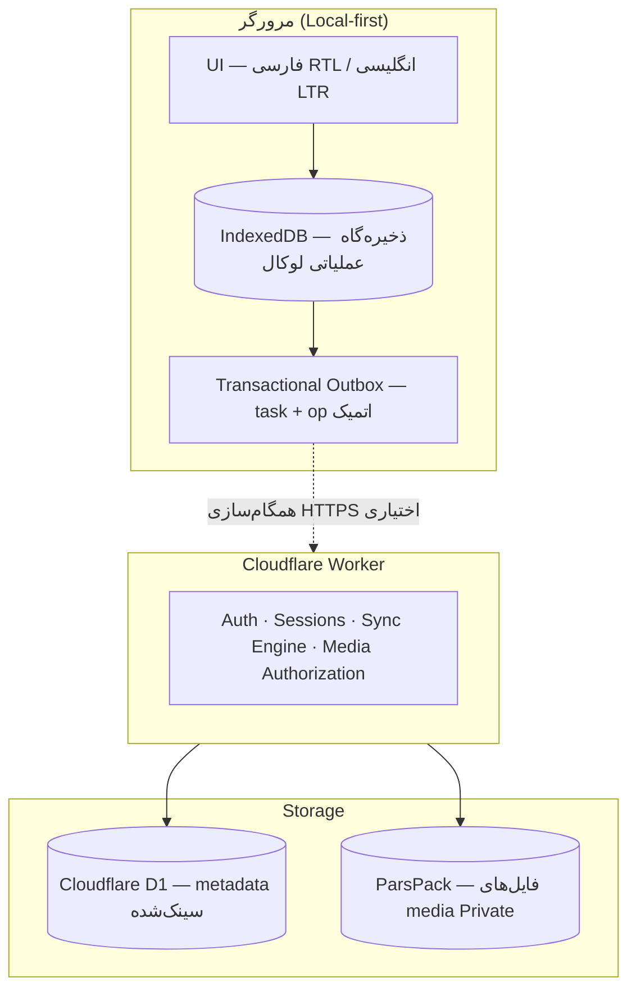

## فایل ۲: `README.fa.md` (فارسی)

**⚠️ این نسخه، ترجمه‌ی ساختاریِ README.md است — نه ترجمه‌ی تحت‌اللفظی. محتوا یکسان است، فقط زبان فارسی و RTL.**

```markdown
# راه فردا

> 🇬🇧 **[English version →](./README.md)**

**یک برنامه‌ریز شخصی فارسی (تقویم جلالی) با طراحی Local-first — با پشتیبانی آفلاین و همگام‌سازی ابری اختیاری بین دستگاه‌ها.**

[](https://mahdi-amouzegar.github.io/rahe_farda/)
[](https://vitejs.dev/)
[](https://workers.cloudflare.com/)
[](https://web.dev/progressive-web-apps/)
[](#مجوز)

---

## ۱. راه فردا چیست؟

راه فردا یک **برنامه‌ریز شخصی فارسی-first و RTL-native** است که حول **تقویم جلالی (هجری شمسی)** طراحی شده. این برنامه به شما کمک می‌کند کارهای روزانه، برنامه‌های چندمرحله‌ای و دوره‌های تکرارشونده‌تان را مدیریت کنید — با نقشه، پشتیبانی آفلاین و همگام‌سازی چنددستگاهی اختیاری.

**سه نوع فعالیت:**

| نوع | توضیح |
|-----|-------|
| **کار** | یک فعالیت مستقل، به‌همراه تاریخ سررسید و مکان اختیاری. |
| **برنامه** | یک فعالیت چندمرحله‌ای متشکل از زیرکارها. |
| **دوره** | یک فعالیت تکرارشونده در چند تاریخ (روزانه، هفتگی، ماهانه یا سفارشی). |

راه فردا **یک برنامه‌ریز میلادی با پوسته‌ی فارسی نیست.** تقویم، تجزیه‌ی تاریخ از متن فارسی (`فردا ساعت ۵`)، نمایش اعداد و جریان UI، همه از ابتدا فارسی-native طراحی شده‌اند — و انگلیسی به‌عنوان زبان دوم پشتیبانی می‌شود.

---

## ۲. چرا راه فردا؟

- 📅 **تقویم جلالی native** — نه یک لایه‌ی ترجمه روی تقویم میلادی.
- 📴 **آفلاین-first** — برنامه برای قابلیت‌های اصلی بدون اینترنت کار می‌کند.
- 🚫 **بدون نیاز به حساب کاربری** — همه‌ی قابلیت‌های اصلی به‌صورت ناشناس کار می‌کنند. همگام‌سازی ابری اختیاری است و نیاز به حساب تلگرام دارد.
- 🌐 **دو‌زبانه** — فارسی (RTL) و انگلیسی (LTR) با یک دکمه.
- 📱 **قابل نصب** — PWA روی هر دستگاه، و اندروید از طریق TWA.
- 🔒 **Local-first** — داده‌ها به‌صورت پیش‌فرض روی دستگاه ذخیره می‌شوند؛ همگام‌سازی ابری opt-in است.
- 🗺️ **مکان‌محور** — مکان‌های ذخیره‌شده، محاسبه‌ی مسیر، ردیابی زنده.
- 🎤 **ورودی صوتی** — تبدیل گفتار به متن فارسی و انگلیسی.
- 🛡️ **امنیت در معماری** — authentication، authorization، مدیریت session/device، sync idempotent، ذخیره‌ی امن media، و Security Gate در هر فاز.

---

## ۳. قابلیت‌های کلیدی

### مدیریت کارها
- ایجاد، ویرایش، حذف و علامت‌گذاری کارها
- تعیین سررسید با تقویم جلالی
- اولویت، توضیحات، تلفن، آدرس، وب‌سایت
- پیوست عکس (حداکثر ۸ عکس در هر کار، با تبدیل خودکار به WebP)
- تجزیه‌ی هوشمند تاریخ از متن فارسی (`فردا ساعت ۵`، `۳ روز دیگر`)
- سطل زباله با نگهداری ۳۰ روزه

### برنامه‌ها و دوره‌ها
- برنامه‌های چندمرحله‌ای با زیرکارها و پیگیری پیشرفت
- دوره‌های تکرارشونده (روزانه، هفتگی، ماهانه، ساعتی، بازه‌ی سفارشی)
- قالب‌های آماده (سفر، اسباب‌کشی، آمادگی امتحان و ...)

### تقویم و زمان
- تقویم جلالی native
- نمایش روزانه با فیلتر
- خلاصه‌ی صبحگاهی با رویدادهای پیش‌رو
- همگام‌سازی زمان با سرور (با fallback آفلاین)

### نقشه و مکان‌ها
- جستجوی مکان (Nominatim / OSM)
- مکان‌های ذخیره‌شده با نام دلخواه
- محاسبه‌ی مسیر (خودرو، دوچرخه، پیاده)
- ردیابی زنده‌ی موقعیت
- پیش‌بینی هوا برای رویدادهای پیش‌رو (Open-Meteo)

### یادآورها و اعلان‌ها
- یادآور جلسات با فاصله‌ی قابل تنظیم
- سه حالت صدا: ریتم پیش‌فرض، ریتم آماده، TTS
- اعلان دسکتاپ از طریق PWA
- خلاصه‌ی صبحگاهی

### همگام‌سازی و چنددستگاهی (اختیاری)
- ورود با تلگرام برای همگام‌سازی ابری
- اتصال دستگاه جدید با کد یک‌بارمصرف
- **همگام‌سازی تراکنشی آفلاین** — تغییرات لوکال و عملیات sync آن‌ها به‌صورت atomic در IndexedDB ذخیره می‌شوند، با بازیابی پس از crash و پردازش idempotent در سرور
- Cloudflare D1 به‌عنوان authoritative cloud state برای داده‌های sync‌شده

### Media (عکس‌ها)
- تبدیل خودکار به WebP با fallback به JPEG
- آپلود با Presigned URL به ParsPack (Storage سازگار با S3)
- حذف EXIF در سمت کلاینت
- حداکثر ۵ مگابایت ورودی، حداکثر ۸ عکس در هر کار

### UI و Accessibility
- فارسی (RTL) و انگلیسی (LTR)
- سه حالت تم: روشن، تاریک، خودکار
- حالت ساده و حرفه‌ای
- واکنش‌گرا برای موبایل و دسکتاپ
- رابط کاربری مناسب کیبورد

---

## ۴. وضعیت فعلی

### ✅ پیاده‌سازی‌شده (امروز قابل استفاده)

- برنامه‌ریز آفلاین-first با تقویم جلالی
- کارها، برنامه‌ها، دوره‌ها، زیرکارها
- نقشه، جستجوی مکان، مسیر، ردیابی زنده
- پیش‌بینی هوا
- یادآورها و خلاصه‌ی صبحگاهی
- ورودی صوتی (فارسی + انگلیسی)
- پیوست عکس با تبدیل WebP
- نصب PWA (مرورگر + اندروید TWA)
- ورود با تلگرام با مدیریت session/device
- همگام‌سازی چنددستگاهی با Transactional Outbox
- رابط دو‌زبانه (فارسی + انگلیسی)

### ⏳ در حال انجام / بعدی

- **Phase 4D** — بومی‌سازی اعداد و واحدها (اعداد جلالی در فارسی، لاتین در انگلیسی)

### 🗓️ برنامه‌ریزی‌شده

- ارتباطات (connections، blocks، پیام‌های خصوصی)
- گروه‌ها (ایجاد، دعوت، اعضا، وظایف گروهی، تایم‌لاین گروهی)
- همگام‌سازی گروه با change sequence مستقل
- Sidebar با جستجوی یکپارچه
- Welcome Wizard
- Backup & Restore نسخه ۲
- Account Lifecycle (حذف، انتقال، anonymization)
- Rate Limiting و Final Security Audit

### ❌ موکول‌شده

- ورود با Google (Google Cloud Console در ایران محدود است)
- ایمیل + رمز عبور (سرویس‌های ایمیل در ایران محدود هستند)

---

## ۵. معماری

### نمودار سطح بالا



### اصول کلیدی

- **Local-first** — مرورگر منبع عملیاتی برای داده‌های شخصی است.
- **D1 به‌عنوان authoritative cloud state** — فقط برای داده‌هایی که صریحاً sync شده‌اند.
- **Media خارج از D1** — فایل‌ها به Object Storage Private از طریق Presigned URL کوتاه‌عمر می‌روند.
- **قرارداد مرکزی Sync** — هر Feature از همان مسیر Sync استفاده می‌کند؛ بدون protocol مخصوص.
- **Security به‌عنوان Cross-Cutting Concern** — هر فاز با Security Gate تمام می‌شود؛ Final Audit بعد از Phase 9.

---

## ۶. پشته‌ی فناوری

| لایه | فناوری |
|------|--------|
| Frontend | Vanilla HTML / CSS / JS (بدون framework) + Vite 6 |
| Backend | Cloudflare Workers (TypeScript) |
| Database | Cloudflare D1 (SQLite) |
| Object Storage | ParsPack (سازگار با S3، MinIO backend) |
| Auth | Telegram Login + sessions/devices (Google و Email موکول) |
| Maps | Leaflet + OpenStreetMap |
| Geocoding | Nominatim |
| Routing | OSRM (routing.openstreetmap.de) |
| Weather | Open-Meteo |
| Hosting | GitHub Pages (client) + Cloudflare Workers (API) |
| Testing | Vitest + jsdom |

---

## ۷. شروع سریع

### به‌عنوان کاربر

**[→ باز کردن دموی زنده](https://mahdi-amouzegar.github.io/rahe_farda/)**

یا نصب به‌عنوان PWA:

۱. آدرس دمو را در Chrome، Edge یا Safari باز کنید.
۲. از «Install» در نوار آدرس (یا «Add to Home Screen» در موبایل) استفاده کنید.
۳. بدون نیاز به حساب — بلافاصله کار اضافه کنید.

### به‌عنوان توسعه‌دهنده

```bash
# Clone
git clone https://github.com/Mahdi-Amouzegar/rahe_farda.git
cd rahe_farda

# Install
npm install

# Dev server
npm run dev

# Build
npm run build

# Preview
npm run preview

# Tests
npm test
بک‌اند (Cloudflare Worker + D1) در ریپازیتوری جداگانه است:

bash
git clone https://github.com/Mahdi-Amouzegar/rahe-farda-worker.git
۸. نقشه‌ی راه
وضعیت	مرحله
✅	برنامه‌ریز آفلاین-first اصلی
✅	احراز هویت و اتصال دستگاه
✅	زیرساخت همگام‌سازی چنددستگاهی
✅	ذخیره‌ی Media (WebP + ParsPack)
✅	رابط انگلیسی
⏳	بومی‌سازی اعداد و واحدها
🗓️	ارتباطات و گروه‌ها (DB + API)
🗓️	همگام‌سازی گروه
🗓️	UI ارتباطات و گروه
🗓️	Backup / Restore نسخه ۲
🗓️	Account Lifecycle و Security Hardening
🗓️	Final Security Audit
۹. حریم خصوصی
راه فردا برای استفاده‌ی شخصی و آفلاین-first طراحی شده است:

قابلیت‌های اصلی بدون حساب کاربری کار می‌کنند. داده‌ها به‌صورت پیش‌فرض روی دستگاه ذخیره می‌شوند.

همگام‌سازی ابری اختیاری است. ورود با تلگرام فقط در صورت فعال‌سازی همگام‌سازی چنددستگاهی الزامی است.

سرویس‌های خارجی فقط برای قابلیت‌های خاص استفاده می‌شوند — نقشه، geocoding، مسیریابی، پیش‌بینی هوا و تبدیل گفتار به متن. داده‌ی ارسالی به این سرویس‌ها محدود به آن چیزی است که برای عملیات درخواستی لازم است. محتوای وظایف به‌عنوان بخشی از عملیات عادی نقشه، هوا یا geocoding ارسال نمی‌شود.

فایل‌های Media در یک bucket Private ذخیره می‌شوند و فقط از طریق Presigned URL کوتاه‌عمر که بعد از احراز هویت توسط بک‌اند صادر می‌شود، قابل دسترسی هستند.

برای جزئیات کامل، به صفحه‌ی حریم خصوصی درون برنامه مراجعه کنید.

۱۰. مجوز
© ۱۴۰۵ / ۲۰۲۶ مهدی آموزگار — همه حقوق محفوظ است.

این یک نرم‌افزار source-available است، نه open-source.

شما می‌توانید:

کد منبع را در GitHub مشاهده کنید.

ریپازیتوری را برای استفاده‌ی شخصی clone کنید.

باگ‌ها و پیشنهادهای قابلیت را از طریق GitHub Issues گزارش دهید.

شما مجاز نیستید:

نرم‌افزار را بازتوزیع، sublicense یا بفروشید.

کد را تغییر دهید و نسخه‌ی مشتق‌شده منتشر کنید.

کد را در پروژه‌های دیگر بدون اجازه‌ی کتبی استفاده کنید.

از نام، لوگو یا برند بدون اجازه‌ی کتبی استفاده کنید.

گزارش باگ و پیشنهاد قابلیت پذیرفته می‌شود. Pull Request پذیرفته نمی‌شود.

برای استعلام مجوز، از طریق LinkedIn در تماس باشید.

تقدیر و تشکر
راه فردا روی شانه‌های این پروژه‌های open-source ساخته شده است:

Leaflet — رندر نقشه

OpenStreetMap — tileهای نقشه

Nominatim — geocoding

OSRM — مسیریابی

Open-Meteo — پیش‌بینی هوا

Vazirmatn — فونت فارسی

Vite — ابزار build

Cloudflare Workers — پلتفرم backend

ParsPack — Storage سازگار با S3

Made with ❤ by مهدی آموزگار

راه فردا — کارهایت، زمانت، مسیرت.

text

---