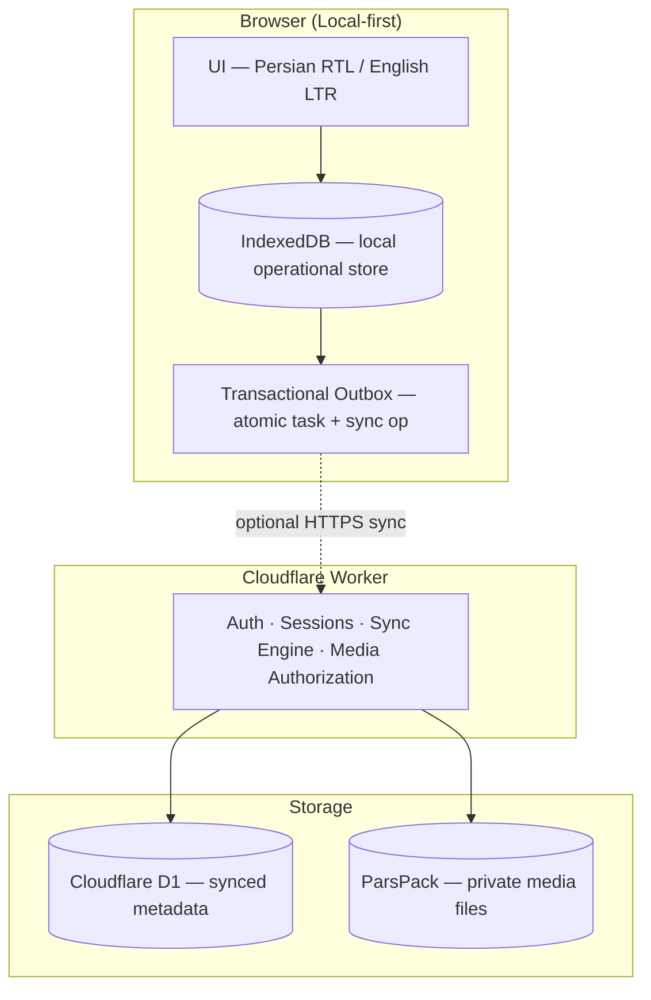

# Rahe Farda

> 🇮🇷 **[نسخه‌ی فارسی / Persian version →](./README.fa.md)**

**A local-first Persian (Jalali) personal planner — with offline support and optional multi-device cloud sync.**

[](https://mahdi-amouzegar.github.io/rahe_farda/)
[](https://vitejs.dev/)
[](https://workers.cloudflare.com/)
[](https://web.dev/progressive-web-apps/)
[](#license)

---

## 1. What is Rahe Farda?

Rahe Farda is a **Persian-first, RTL-native personal planner** designed around the **Jalali (Solar Hijri) calendar**. It helps you manage daily tasks, multi-step projects, and recurring series — with optional map integration, offline support, and multi-device sync.

**Three types of activities:**

| Type | Description |
|------|-------------|
| **Task** | A single activity, optionally with a due date and location. |
| **Plan** | A multi-step activity composed of sub-tasks. |
| **Series** | A recurring activity across multiple dates (daily, weekly, monthly, or custom). |

Rahe Farda is **not** a Gregorian planner with a Persian skin. The calendar, the date parsing (`فردا ساعت ۵`), the number rendering, and the UI flow are all Persian-native by design — with full English support as a second language.

---

## 2. Why Rahe Farda?

- 📅 **Jalali calendar native** — not a translation layer on top of Gregorian.
- 📴 **Offline-first** — the app works without an internet connection for core features.
- 🚫 **No account required** — all core features work anonymously. Cloud sync is optional and requires a Telegram account.
- 🌐 **Bilingual** — Persian (RTL) and English (LTR) with a single toggle.
- 📱 **Installable** — PWA on any device, plus Android via TWA.
- 🔒 **Local-first** — your data is stored locally by default; cloud sync is opt-in.
- 🗺️ **Location-aware** — saved places, route calculation, live tracking.
- 🎤 **Voice input** — speech-to-text in Persian and English.
- 🛡️ **Security built into the architecture** — authentication, authorization, session/device management, idempotent sync, private media storage, per-feature security gates.

---

## 3. Key Features

### Task Management
- Create, edit, delete, complete tasks
- Due dates with Jalali calendar picker
- Priority levels, descriptions, phone, address, website
- Photo attachments (up to 8 per task, auto-converted to WebP)
- Smart date parsing from Persian text (`فردا ساعت ۵`, `۳ روز دیگر`)
- Trash with 30-day retention

### Plans & Series
- Multi-step plans with sub-tasks and progress tracking
- Recurring series (daily, weekly, monthly, hourly, custom intervals)
- Templates for common workflows (travel, moving, exam prep, etc.)

### Calendar & Time
- Native Jalali calendar
- Day view with filters
- Morning digest with upcoming events
- Server-corrected time with offline fallback

### Maps & Locations
- Place search (Nominatim / OSM)
- Saved locations with custom names
- Route calculation (car, bike, foot)
- Live location tracking
- Weather forecast for upcoming events (Open-Meteo)

### Notifications & Reminders
- Session reminders with configurable lead time
- Three sound modes: default chime, preset, and TTS
- Desktop notifications via PWA
- Morning digest

### Sync & Multi-Device (Optional)
- Telegram login for cloud sync
- Device linking via one-time sync codes
- **Transactional offline sync** — local changes and their sync operations are persisted atomically in IndexedDB, with crash recovery and idempotent server processing
- Cloudflare D1 as authoritative cloud state for synced data

### Media (Photos)
- Automatic WebP conversion with JPEG fallback
- Presigned-URL upload to ParsPack (S3-compatible storage)
- EXIF stripped on the client
- Max 5MB input, max 8 photos per task

### UI & Accessibility
- Persian (RTL) and English (LTR)
- Light, Dark, and Auto themes
- Simple and Pro modes
- Responsive for mobile and desktop
- Keyboard-friendly interface

---

## 4. Current Status

### ✅ Implemented (Available Today)

- Offline-first planner with Jalali calendar
- Tasks, Plans, Series, sub-tasks
- Maps, place search, routes, live tracking
- Weather forecast
- Reminders and morning digest
- Voice input (Persian + English)
- Photo attachments with WebP conversion
- PWA install (browser + Android TWA)
- Telegram login with session/device management
- Multi-device sync with transactional outbox
- Bilingual interface (Persian + English)

### ⏳ In Progress / Next

- **Phase 4D** — Number & unit localization (Jalali numbers in Persian, Latin in English)

### 🗓️ Planned

- Communication (connections, blocks, direct messages)
- Groups (create, invite, members, group tasks, group timeline)
- Group sync with independent change sequences
- Sidebar navigation with unified search
- Welcome wizard
- Backup & Restore v2
- Account lifecycle (deletion, transfer, anonymization)
- Rate limiting and final security audit

### ❌ Deferred

- Google Login (Google Cloud Console restricted in Iran)
- Email + Password (email services restricted in Iran)

---

## 5. Architecture

### High-Level Diagram



### Key Principles

- **Local-first** — the browser is the operational source of truth for personal data.
- **D1 as authoritative cloud state** — only for data that has been explicitly synced.
- **Media lives outside D1** — files go to private object storage via short-lived presigned URLs.
- **Central sync contract** — every feature uses the same sync path; no per-feature protocols.
- **Security as a cross-cutting concern** — every phase ends with a security gate; a final audit is planned after Phase 9.

---

## 6. Tech Stack

| Layer | Technology |
|-------|------------|
| Frontend | Vanilla HTML / CSS / JS (no framework) + Vite 6 |
| Backend | Cloudflare Workers (TypeScript) |
| Database | Cloudflare D1 (SQLite) |
| Object Storage | ParsPack (S3-compatible, MinIO backend) |
| Auth | Telegram Login + sessions/devices (Google & Email deferred) |
| Maps | Leaflet + OpenStreetMap |
| Geocoding | Nominatim |
| Routing | OSRM (routing.openstreetmap.de) |
| Weather | Open-Meteo |
| Hosting | GitHub Pages (client) + Cloudflare Workers (API) |
| Testing | Vitest + jsdom |

---

## 7. Getting Started

### As a User

**[→ Open the Live Demo](https://mahdi-amouzegar.github.io/rahe_farda/)**

Or install it as a PWA:

1. Open the demo URL in Chrome, Edge, or Safari.
2. Use "Install" in the address bar (or "Add to Home Screen" on mobile).
3. No account required — start adding tasks immediately.

### As a Developer

```bash
# Clone
git clone https://github.com/Mahdi-Amouzegar/rahe_farda.git
cd rahe_farda

# Install
npm install

# Dev server
npm run dev

# Build
npm run build

# Preview
npm run preview

# Tests
npm test
```

The backend (Cloudflare Worker + D1) lives in a separate repository:

```bash
git clone https://github.com/Mahdi-Amouzegar/rahe-farda-worker.git
```
8. Roadmap
Status	Milestone
✅	Core offline-first planner
✅	Authentication & device linking
✅	Multi-device sync infrastructure
✅	Media storage (WebP + ParsPack)
✅	English interface
⏳	Number & unit localization
🗓️	Communication & groups (database + API)
🗓️	Group synchronization
🗓️	Communication & group UI
🗓️	Backup / restore v2
🗓️	Account lifecycle & security hardening
🗓️	Final security audit
9. Privacy
Rahe Farda is designed for personal, offline-first use:

Core features work without an account. Your data is stored locally by default.

Cloud sync is optional. Telegram login is required only if you enable multi-device sync.

Third-party services are used only for specific features — maps, geocoding, routing, weather, and speech recognition. The data sent to these services is limited to what is required for the requested operation. Task content is not sent as part of normal map, weather, or geocoding operations.

Media files are stored in a private bucket, accessible only via short-lived presigned URLs issued by the backend after authentication.

For full details, see the in-app Privacy page.

10. License
© 1405 / 2026 Mahdi Amouzegar. All rights reserved.

This is source-available software, not open-source.

You may:

View the source code on GitHub.

Clone the repository for personal use.

Report bugs and suggest features via GitHub Issues.

You may NOT:

Redistribute, sublicense, or sell the software.

Modify and publish derivative works.

Use the code in other projects without written permission.

Use the name, logo, or branding without written permission.

Issues and bug reports are welcome. Pull requests are not accepted.

For licensing inquiries, please reach out via LinkedIn.

Acknowledgments
Rahe Farda is built on the shoulders of these open projects:

Leaflet — map rendering

OpenStreetMap — map tiles

Nominatim — geocoding

OSRM — routing

Open-Meteo — weather forecast

Vazirmatn — Persian font

Vite — build tool

Cloudflare Workers — backend platform

ParsPack — S3-compatible object storage

Made with ❤ by Mahdi Amouzegar

Rahe Farda — Your tasks, your time, your path.

text

---

